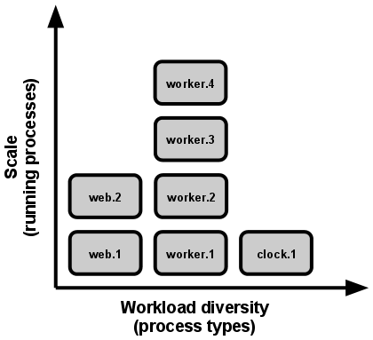

# Slides
https://docs.google.com/presentation/d/1QhPmGKkJolSohZb7jKYEWfBdkUGVQsGAGn2UbQcXqRQ/edit?usp=sharing

# Microservices Cloud Native : Comment et Pourquoi

## Approches Courantes

Le domaine de l'ingénierie logicielle est constamment en évolution, et des principes tels que "Changement Continu", "Complexité Croissante" et "Qualité en Déclin" sont le cœur de chaque solution logicielle qui résout un vrai problème.

Les principes de l'évolution des logiciels ont été formulés en 1974 par [Lehman](https://fr.wikipedia.org/wiki/Meir_Manny_Lehman). Ces principes décrivent un équilibre entre les forces qui poussent pour de nouveaux développements et celles qui ralentissent le progrès. Ils ont été révisés et étendus à plusieurs reprises. ``

Les lois de l'évolution des logiciels de Lehman incluent :

- La loi du **Changement Continu** : la satisfaction du logiciel diminue au fil du temps à moins qu'il ne soit continuellement adapté pour répondre aux nouveaux besoins.
- La loi de **l'Augmentation de la Complexité** : à mesure qu'un grand programme est continuellement modifié, sa complexité augmente, sauf si des efforts sont faits pour la maintenir ou la réduire.
- La loi de **la Baisse de la Qualité** : la qualité d'un système semble décliner à moins qu'il ne soit rigoureusement maintenu et adapté aux changements de l'environnement opérationnel.

Étant donné que les logiciels sont souvent soumis à des changements, Lehman a cherché à identifier les lois qui régissent ces changements et à assurer la viabilité des logiciels.

Les systèmes logiciels ont constamment évolué, mais ces principes ont toujours existé. Par conséquent, les développeurs ont cherché de nouvelles approches pour gérer l'évolution de leurs systèmes tout en respectant ces principes.

Certaines des approches les plus courantes sont les applications à douze facteurs, les microservices et la technologie cloud-native.

## 12 Factor App (L'Application à Douze Facteurs )

Cette méthodologie est un ensemble de bonnes pratiques pour la création et le déploiement d'applications Web ou de logiciels en tant que service. Elle a été développée par l'équipe d'[Heroku](https://www.heroku.com/), un fournisseur de plateforme cloud, et a depuis été largement adoptée par la communauté de développement de logiciels. Comme son nom l'indique, cette méthodologie met l'accent sur douze facteurs :

### I. Base de Code

La méthodologie des douze facteurs d'application stipule qu'une application ne doit avoir qu'une seule base de code qui est suivie dans un système de contrôle de version tel que Git. La base de code doit être un seul référentiel ou un ensemble de référentiels qui partagent un commit racine. De multiples bases de code indiquent un système distribué, où chaque composant doit être traité comme une application distincte. Le partage de code entre différentes applications viole le principe des douze facteurs, et le code partagé doit être divisé en bibliothèques qui peuvent être incluses via un gestionnaire de dépendances.

Une application peut avoir plusieurs déploiements, qui sont des instances en cours d'exécution de l'application, tels que la production, la préproduction et les environnements de développement locaux. Bien que différentes versions de l'application puissent être activées dans chaque déploiement, la base de code reste la même pour tous les déploiements. Les développeurs doivent toujours avoir une copie de la même base de code dans leur environnement de développement local.

En savoir plus: https://12factor.net/codebase

### II. Dépendances

Le deuxième facteur met l'accent sur la nécessité de déclarer et d'isoler explicitement les dépendances.

Un application à Douze Facteurs doit déclarer toutes ses dépendances via une déclaration de dépendances dans un manifeste.

Ce principe s'applique à la fois aux environnements de production et de développement.

La déclaration et l'isolation des dépendances doivent toujours être utilisées ensemble pour respecter les Douze Facteurs. La déclaration explicite des dépendances simplifie la configuration pour les nouveaux développeurs et assure que l'application s'exécute de manière cohérente dans différents environnements.

Les applications ne dépendent pas non plus de l'existence implicite d'aucun outil système. Les outils système nécessaires doivent être inclus dans l'application pour garantir la compatibilité.

Lire la suite : https://12factor.net/dependencies

### III. Configuration

Le troisième facteur consiste à stocker la configuration dans l'environnement et non dans le code.

La configuration de l'application doit être stockée dans des variables d'environnement facilement modifiables entre les déploiements et agnostiques du language et du système d'exploitation.

### IV. Services externes

Un service externe (backing service) correspond à tout service que l’application utilise à travers le réseau pour son fonctionnement nominal. Cela concerne par exemple les bases de données (tel que MySQL ou CouchDB), les systèmes de messages/files (tel que RabbitMQ ou Beanstalkd), les services SMTP pour l’envoi d’email (comme Postfix), ainsi que les systèmes de cache (comme Memcached).

Le code d’une application 12 facteurs ne fait pas de distinction entre les services locaux et les services tiers. Pour l’application, ce sont tous les deux des ressources attachées, accessibles via une URL ou un autre système de localisation et d’authentification stockée dans la configuration. Un déploiement d’une application 12 facteurs doit pouvoir remplacer une base de données MySQL locale par une autre gérée par des tiers (Amazon RDS, par exemple) sans le moindre changement dans le code de l’application.

Lire la suite: https://12factor.net/backing-services

### V. Build, release, run (Assemblez, publiez, exécutez)

Le cinquième facteur met l'accent sur l'importance de la séparation stricte des étapes de build, release et run.

- L’étape d’assemblage (ou “build”) est une transformation qui convertit un dépôt de code en un paquet autonome exécutable appelé l’assemblage (ou “build”). En utilisant une version du code référencée par un commit spécifié lors du processus de déploiement, l’étape d’assemblage va chercher toutes les dépendances externes et compile les fichiers binaires et les ressources.

- L’étape de publication (ou “release”) prend l’assemblage produit à l’étape précédente et le combine avec la configuration de déploiement courante. La release résultante contient à la fois l’assemblage et la configuration, et elle est prête pour une exécution immédiate dans l’environnement d’exécution.

- L’étape d’exécution (ou “runtime”) fait fonctionner l’application dans l’environnement d’exécution, en lançant un ensemble de processus de l’application associée à la release considérée.

En savoir plus : https://12factor.net/build-release-run

### VI. Processus

Ce facteur concerne l'exécution de l'application sous forme d'un ou plusieurs processus stateless qui sont initialisés dans l'environnement d'exécution.

Selon le sixième facteur de la méthodologie des applications en douze facteurs, les processus de douze facteurs doivent être stateless et ne rien partager. Cela signifie que toutes les données qui doivent persister doivent être stockées dans un service de sauvegarde stateful comme une base de données sauvegardée stateful.

Cependant, l'espace mémoire ou le système de fichiers d'un processus peut être utilisé comme cache temporaire pour une seule transaction. Cependant, l'application ne doit pas supposer que le cache sera disponible à l'avenir. L'utilisation de sessions "collantes", qui stockent les données de session de l'utilisateur en mémoire, viole la méthodologie des douze facteurs. Au lieu de cela, les données d'état de session doivent être stockées dans un datastore qui fournit un délai d'expiration, comme [Memcached](https://memcached.org/) ou [Redis](https://redis.com/).

Pour en savoir plus: https://12factor.net/processes

### VII. Association de port

Les applications web sont parfois exécutées à l’intérieur d’un container de serveur web. Par exemple, les applications PHP peuvent fonctionner comme un module à l’intérieur de HTTPD, d’Apache, ou bien les applications Java peuvent fonctionner à l’intérieur de Tomcat.

Les applications 12 facteurs sont complètement auto-contenues et ne se basent pas sur l’injection au moment de l’exécution d’un serveur web dans l’environnement d’exécution pour créer les services exposés au web. L’application web expose HTTP comme un service en l’associant à un port et écoute les requêtes qui arrivent sur ce port.

Pendant le déploiement, une couche de routage gère la redirection des requêtes d'un nom d'hôte public vers les processus web liés à un port.

Pour plus d'informations, consultez ceci: https://12factor.net/port-binding

### VIII. Concurrence

Dans une application 12 facteurs, les processus sont des élèves modèles. Les processus dans une application 12 facteurs s’inspirent fortement du modèle de processus unix pour faire fonctionner les daemon (en). En utilisant ce modèle, les développeurs peuvent structurer l’application pour gérer différents types de charge en assignant chaque type de travail à un type de processus. Par exemple, les requêtes HTTP peuvent être gérées par un processus web, et les tâches d’arrière-plan ayant une longue durée d’exécution peuvent être des processus dits “worker”

En savoir plus : https://12factor.net/concurrency

### IX. Processus jetables

Les processus des applications 12 facteurs sont jetables, c’est-à-dire qu’ils peuvent être démarrés ou stoppés en un instant. Cela simplifie un rapide grossissement vertical, le déploiement rapide du code ou de changements dans la configuration, ainsi que la robustesse des déploiements de production.

Les processus doivent viser à minimiser le temps de démarrage. Idéalement, un processus prend quelques secondes entre le moment où une commande le lance et celui où il est en marche et prêt à recevoir des requêtes ou du travail. Un court temps de démarrage rend les processus de release et de scalabilité verticale plus agiles; il aide également à la robustesse, car les gestionnaires de processus peuvent plus facilement déplacer des processus vers de nouvelles machines physiques lorsque c’est nécessaire.

De plus, une application qui suit les douze facteurs devrait pouvoir gérer des terminaisons inattendues et non gracieuses.

En savoir plus : https://12factor.net/disposability

### X. Parité Dev/Prod

Les applications 12 facteurs sont conçues pour le déploiement continu (en) en gardant un fossé étroit entre le développement et la production. Si l’on regarde les trois fossés décrits plus haut :

- Réduire le fossé temporel : un développeur peut écrire du code et le déployer quelques heures ou même juste quelques minutes plus tard.
- Réduire le fossé des personnes : les personnes qui écrivent le code sont impliquées dans son déploiement et pour surveiller son comportement en production.
- Réduire le fossé des outils : réduire, autant que possible, les différences entre le développement et la production.

En savoir plus: https://12factor.net/dev-prod-parity

### XI. logs

L'application en douze facteurs traite les logs en tant que flux d'événements qui sont ordonnés dans le temps et qui donnent une visibilité sur le comportement d'une application en cours d'exécution.

Une application à douze facteurs écrit son flux d'événements, non mis en mémoire tampon, sur [STDOUT](https://en.wikipedia.org/wiki/Standard_streams) et ne doit pas se soucier du routage ou du stockage de sa sortie.

L'environnement d'exécution enregistre le flux pour chaque processus, en le regroupant avec tous les autres flux d'applications et en le routant vers une ou plusieurs destinations finales pour la visualisation et l'archivage à long terme.

Des routeurs de logs open source tels que [Logplex](https://devcenter.heroku.com/articles/logplex) et [Fluentd](https://www.fluentd.org/), et bien d'autres, sont disponibles à cette fin.

Optionnellement, le flux d'événements d'une application peut être acheminé vers un fichier ou envoyé à un système de journalisation, d'analyse et de visualisation tel que [ELK](https://www.elastic.co/what-is/elk-stack).

En savoir plus: https://12factor.net/logs

#### XII. Administration de processus

Le douzième et dernier facteur des applications à douze facteurs est lié aux tâches d'administration et de gestion qui doivent être exécutées sous forme de processus ponctuels. Par exemple, la migration de base de données ou la collecte de fichiers statiques.

Ces processus administratifs doivent être exécutés dans le même environnement que les processus réguliers de l'application, en utilisant le même code de base et la même configuration.

Le code responsable de ces processus administratifs doit être livré avec le code de l'application pour éviter les problèmes de synchronisation.

Les processus administratifs ad-hoc doivent être exécutés en utilisant les mêmes techniques d'isolation de dépendance que les processus réguliers.

La méthodologie Twelve-Factor recommande l'utilisation de langages qui fournissent une invite de commande REPL par défaut et facilitent l'exécution de scripts ad-hoc. En production, les développeurs peuvent utiliser SSH ou d'autres mécanismes d'exécution de commandes à distance fournis par l'environnement de déploiement pour exécuter des processus administratifs ad-hoc.

Note: Une boucle lecture-évaluation-impression, ou REPL, est un environnement informatique dans lequel les entrées de l'utilisateur sont lues et évaluées, puis les résultats sont renvoyés à l'utilisateur. Les REPL constituent un environnement interactif permettant d'explorer les outils disponibles dans des environnements ou des langages de programmation spécifiques.

En savoir plus: https://12factor.net/admin-processes

## Microservices

Les principes de la méthode en 12 facteurs ont eu un impact significatif sur les pratiques de développement logiciel actuelles. Ils ont inspiré un mouvement vers le développement d'applications en tant que services faiblement couplés, appelés microservices.

Les microservices sont une architecture pour la construction de systèmes logiciels. Elle divise les différents composants du système en éléments plus petits et plus gérables appelés microservices. Chaque microservice a une seule responsabilité et peut être développé et déployé indépendamment des autres.

L'approche des microservices aborde les défis identifiés dans les lois de l'évolution des logiciels de Lehman :

- La loi du changement continu est abordée en simplifiant l'adaptation et la mise à jour de chaque microservice sans avoir à changer l'ensemble du système.
- La loi de la complexité croissante est abordée en divisant le système en des composants plus petits et plus gérables.
- La loi de la baisse de qualité est abordée en simplifiant la maintenance et la mise à jour de chaque microservice avec moins de contraintes sur l'ensemble du système et en fournissant des mécanismes pour surveiller et gérer tout le système.

L'architecture de microservices offre des avantages supplémentaires tels que la scalabilité, la flexibilité, des tests et un déploiement plus faciles. Ces avantages en font une technique optimale pour construire des systèmes logiciels grands et complexes.

Avant l'émergence des modèles de microservices, les développeurs devaient traiter avec des systèmes monolithiques.

Les applications monolithiques combinent toutes les fonctionnalités et les modules en une seule application volumineuse. Bien que cette approche puisse fonctionner bien pour les projets à petite échelle, elle peut devenir problématique à mesure que l'application devient plus grande et complexe.

En d'autres termes, à mesure que l'application monolithique devient plus grande, il peut être plus difficile de la maintenir et de la mettre à jour. De plus, différents composants de l'application peuvent commencer à interférer les uns avec les autres, causant des problèmes difficiles à diagnostiquer et à résoudre.

D'autre part, les microservices sont une approche architecturale pour la construction d'applications où différents composants sont divisés en morceaux plus petits et plus gérables.

Chaque microservice a une seule responsabilité et peut être développé et déployé indépendamment du reste. Cela rend plus facile le développement et la maintenance de l'application, ainsi que l'augmentation de sa flexibilité et de sa scalabilité.

Les microservices permettent aux équipes de travailler indépendamment sur différentes parties d'une application, en utilisant le langage de programmation, le framework, les outils et le stockage de données avec lesquels ils sont les plus à l'aise. Lorsqu'ils sont gérés de manière appropriée, cela peut entraîner des améliorations significatives de la productivité. De plus, les microservices peuvent être développés et déployés indépendamment, ce qui facilite la mise à l'essai et le déploiement de nouvelles fonctionnalités avec peu ou pas de temps d'arrêt.

L'un des travaux documentaires les plus remarquables concernant les microservices est [les patrons de microservices de Chris Richardson] (https://microservices.io/patterns/index.html). Ces patrons sont disponibles publiquement sur [microservices.io] (https://microservices.io/patterns/index.html). Certains des plus courants sont:

### Base de données par service

Dans une architecture de microservices, chaque service doit avoir sa propre base de données privée qui ne peut être accédée que par le biais de son API. 

Étant donné que les services peuvent avoir des exigences de stockage de données différentes, ils peuvent utiliser différents types de bases de données.

Cependant, la mise en œuvre de transactions et de requêtes impliquant plusieurs services peut être un défi et peut nécessiter des modèles tels que `Saga`, `Composition d'API` et `CQRS`. Il est conseillé d'éviter l'anti-patron de "base de données partagée" car cela peut entraîner des problèmes lors de l'extension et de la maintenance du système.

### Composition d'API

Cette conception consiste à implémenter des requêtes dans une architecture de microservices en utilisant un compositeur d'API pour la collaboration de services.

Cela permet une manière simple de consulter les données de plusieurs services, mais peut entraîner des jonctions inefficaces de grands ensembles de données.

Ce modèle est nécessaire en raison du modèle Database per Service (Base de données par service), et CQRS est une solution alternative.

Note: Le CQRS (Command Query Responsibility Segregation) est un modèle d'architecture logicielle qui sépare les opérations de lecture (queries) des opérations d'écriture (commands) dans un système. Il propose de diviser la logique métier en deux parties distinctes : une partie qui gère les opérations de lecture et une autre qui gère les opérations d'écriture.

Traditionnellement, dans les systèmes CRUD (Create, Read, Update, Delete), la même logique est utilisée pour traiter les opérations de lecture et d'écriture sur les données. Cependant, le CQRS préconise une séparation plus nette entre ces deux types d'opérations, car ils ont souvent des caractéristiques différentes en termes de besoins, de modèles de données, de performances, etc.

### Instance de service par conteneur

Ce modèle met l'accent sur l'importance d'utiliser des conteneurs, tels que Docker, pour packager et déployer des services dans une architecture de microservices. Le modèle implique la conteneurisation de chaque service en tant qu'image Docker et le déploiement de chaque instance de service en tant que conteneur.

Utiliser des conteneurs offre des avantages tels que la scalabilité, l'isolation et la limitation des ressources.

### Externalisation de la configuration

Ce modèle consiste à externaliser les données de configuration d'applications afin de permettre à un service de s'exécuter dans plusieurs environnements sans avoir besoin de le modifier.

La solution consiste à configurer les services de manière à ce qu'ils lisent la configuration à partir d'une source externe lors du démarrage. 

Les avantages de ce modèle incluent la possibilité d'exécuter une application dans plusieurs environnements sans avoir besoin de la modifier ou de la recompiler. 

### Découverte de service côté serveur

Le modèle de communication entre les services et la découverte de service est nécessaire dans une application basée sur des microservices.

Comme le nombre et l'emplacement des instances de service peuvent changer de manière dynamique, les clients de service ont besoin d'un mécanisme pour effectuer des requêtes vers un ensemble constamment changeant d'instances de service éphémères.

La solution consiste à utiliser un routeur de découverte de service côté serveur qui interroge un registre de service et transfère la demande aux instances disponibles.

Cela simplifie le code client et est proposé par des environnements cloud tels que [AWS Elastic Load Balancer](https://aws.amazon.com/elasticloadbalancing/). Cependant, cela nécessite des composants système supplémentaires et des sauts de réseau supplémentaires.

### Disjoncteur (Circuit Breaker)

Ce modèle se concentre sur la gestion des services distants en échec dans l'architecture des microservices.

Un disjoncteur agit en tant que proxy pour éviter que les échecs n'affectent d'autres services. Lorsque le nombre d'échecs consécutifs dépasse un certain seuil, le disjoncteur est déclenché et toutes les tentatives d'appeler le service distant échouent immédiatement pendant une période limitée. Si le nombre limité de demandes de test pendant la période est réussi, le disjoncteur reprend un fonctionnement normal ; sinon, la période commence de nouveau. 

Ce modèle peut être mis en œuvre en utilisant des bibliothèques telles que [Netflix Hystrix](https://github.com/Netflix/Hystrix) (actuellement en mode maintenance) ou toute alternative comme [Istio](https://istio.io/). Il peut être utilisé dans des services conçus avec une coque de microservice, une passerelle API ou un routeur de découverte de service côté serveur.

Le défi ici est de choisir les bonnes valeurs de temporisation sans provoquer de faux positifs ou une latence excessive.

### Le Cloud Native

L'approche des microservices nécessite non seulement de nouvelles façons de penser et de concevoir des systèmes logiciels, mais également de nouveaux outils et technologies pour gérer le déploiement, la coordination, la surveillance et d'autres aspects de l'ingénierie logicielle.

Avec l'émergence des microservices, un nouveau concept d'applications nativement conçu pour le cloud est apparu.

Une approche Cloud Native tire parti des avantages des conteneurs de cloud computing tels que Docker et des outils d'orchestration tels que Kubernetes, tels que l'élasticité et la disponibilité, pour construire et exploiter des applications conçues pour fonctionner dans le cloud.

Les applications Cloud Native sont construites à l'aide de microservices conteneurisés, permettant un déploiement, une mise à l'échelle et une administration sans effort dans un environnement cloud.

## Des monolithes aux microservices Cloud Native

Le changement d'architecture logicielle, des monolithes aux microservices, puis aux applications Cloud Native, a été une expérience phénoménale qui a influencé la manière dont nous concevons et livrons des applications.

Les microservices décomposent les monolithes en composants plus petits et indépendants, tandis que les microservices Cloud Natives ont conduit à une nouvelle ère de conception et de livraison de systèmes dans le cloud.

Kubernetes, avec son écosystème d'outils et de technologies, a joué un rôle important en facilitant cette transition en permettant aux développeurs de gérer, de mettre à l'échelle et d'orchestrer rapidement leurs plates-formes basées sur des microservices. Ses capacités solides, telles que l'orchestration de conteneurs, la découverte de services et l'auto-scaling, ont été bénéfiques pour accélérer le développement de microservices Cloud Natives.

Cette formation explore Kubernetes et son écosystème, discute de nouveaux défis et opportunités qu'il introduit, et vous apprend comment l'utiliser pour déployer, gérer, surveiller, et mettre à l'échelle des microservices cloud-native.

Nous allons également discuter de certaines pratiques et schémas optimaux pour construire des systèmes résilients, évolutifs, et maintenables basés sur des microservices à l'aide de Kubernetes.
