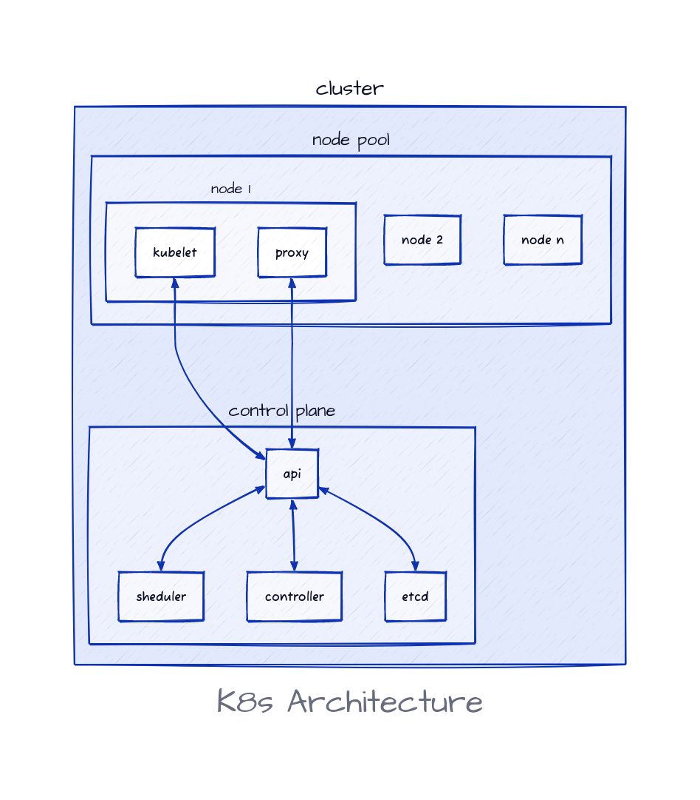

# Vue d'ensemble de l'architecture Kubernetes

## Introduction

Kubernetes est un système distribué composé de plusieurs éléments qui travaillent ensemble afin de fournir une plateforme hautement disponible, évolutive et résiliente.

L'architecture de Kubernetes est construite sur un cluster de noeuds, chaque noeud représentant une machine individuelle dans le cluster. Ces noeuds travaillent ensemble pour former un système hautement disponible et tolérant aux pannes qui est capable d'exécuter un grand nombre d'applications conteneurisées.

Kubernetes est composé de deux principaux éléments :

- Control plane (noeud maître)
- Workers (noeuds de travail)

Chaque cluster a au moins 1 Control Plane et 1 nœud de worker.

## Le Control Plane

Le Control Plane est composé de plusieurs autres composants, chacun jouant un rôle spécifique dans la gestion et la surveillance du cluster.

Voici une brève description de chaque composant:

### etcd

etcd est un système de stockage de données clé-valeur distribué utilisé pour stocker la configuration et l'état du cluster.

### API Server (kube-apiserver)

Le API Server est le principal point d'entrée pour les interactions avec le cluster. Il expose une API RESTful qui permet aux utilisateurs de créer, modifier et supprimer des objets dans le cluster à l'aide d'une CLI comme kubectl, un SDK ou en appelant l'API directement.

### Controller Manager (kube-controller-manager)

Le Controller Manager est responsable de la gestion des contrôleurs Kubernetes. Ces contrôleurs surveillent l'état des objets dans le cluster et prennent des mesures pour garantir que l'état souhaité est maintenu.

### Cloud Controller Manager (cloud-controller-manager)

Il s'agit d'un composant spécifique au cloud qui gère les services liés à des plates-formes spécifiques, telles qu'AWS, GCP, etc.

### Scheduler (kube-scheduler)

Le Scheduler (planificateur) attribue des pods à des nœuds dans le cluster, en veillant à ce qu'ils soient placés sur des nœuds disposant des ressources nécessaires pour les exécuter.

## Les nœuds workers

Ces nœuds sont les machines sur lesquelles Kubernetes exécute les charges de travail de l'utilisateur. Chaque nœud d'un cluster exécute les composants suivants:

### Kubelet

Kubelet est l'agent Kubernetes qui s'exécute sur chaque nœud. Il est responsable de la communication avec le Control Plane et de la gestion des pods et des conteneurs sur le nœud.

### Container Runtime

Le Container Runtime est l'outil utilisé pour exécuter les conteneurs. Les Container Runtimes les plus courants sont [Docker](https://github.com/moby/moby), [containerd](https://github.com/containerd/containerd) et [CRI-O](https://github.com/cri-o/cri-o).

### Kube-proxy

Le kube-proxy est un proxy réseau qui s'exécute sur chaque noeud. Il est responsable de la gestion du trafic réseau entre les Pods dans le cluster.

## Nodepools (Pools de noeuds)

Un nodepool est un groupe de noeuds identiques (ou workers) dans un cluster Kubernetes. Il permet de regrouper les noeuds en fonction de leurs capacités de traitement et de leur rôle dans le cluster.

Un nodepool peut être utilisé pour des tâches spécifiques, telles que l'exécution de charges de travail nécessitant une puissance de calcul élevée ou l'hébergement d'applications requérant un stockage de données important.

Chaque nodepool possède une configuration et un label spécifiques qui permettent de l'identifier et de le gérer indépendamment des autres noeuds du cluster.

Les Nodepools permettent une gestion plus efficace et granulaire des ressources dans un cluster Kubernetes, permettant aux administrateurs de déployer et de gérer les noeuds en fonction des besoins spécifiques des applications et des services.

Un cas d'utilisation typique des Nodepools dans Kubernetes est lorsque vous avez besoin de mettre à l'échelle votre application horizontalement en ajoutant ou en supprimant des noeuds de travail pour gérer la charge de travail. Les Nodepools vous permettent de créer des groupes de noeuds avec des caractéristiques similaires et d'assigner différents charges de travail à chacun. Par exemple, vous pouvez créer un nodepool pour les tâches intensives en CPU et un autre nodepool pour les tâches intensives en mémoire, et assigner des Pods à ces Nodepools en fonction de leurs besoins en ressources.

Dans un cluster, des pools de nœuds individuels peuvent être créés, mis à niveau et supprimés sans affecter l'ensemble du cluster ou les autres nœuds dans différents pools de nœuds. Cependant, lors de la modification de la configuration d'un pool de nœuds, les modifications s'appliqueront à tous les nœuds de ce pool ; il n'est pas possible de configurer un seul nœud dans un pool.

Les Nodepools peuvent également aider à la mise à niveau de Kubernetes. En créant un nouveau nodepool avec la version mise à jour de Kubernetes, un administrateur peut déplacer graduellement les charges de travail de l'ancien pool vers le nouveau pool.

## Aperçu de l'architecture

Le schéma suivant montre les différents composants d'un cluster Kubernetes.

