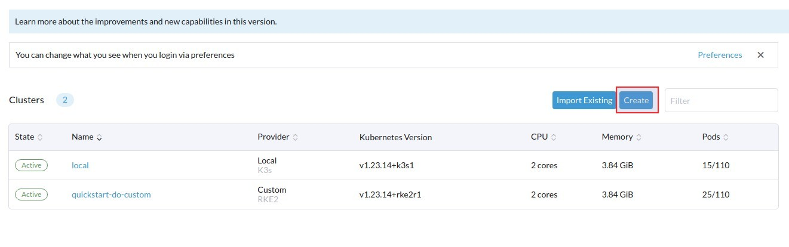
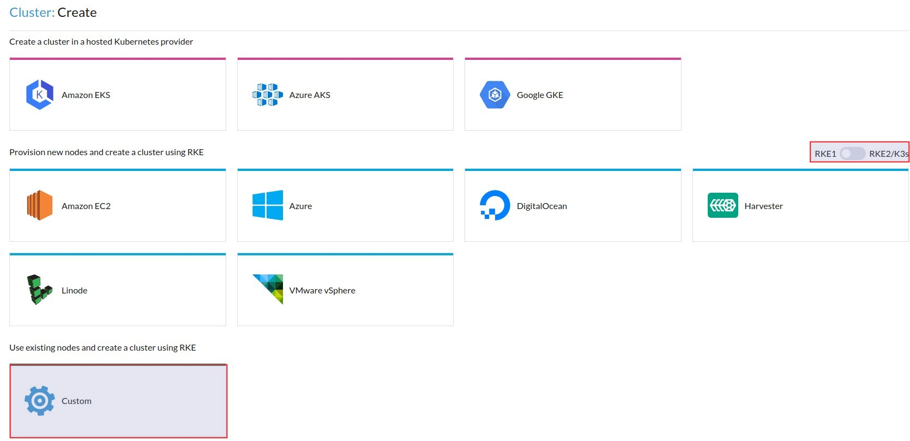
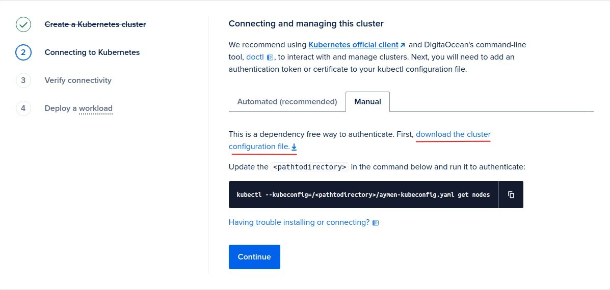

# Kubernetes : création d'un cluster

## Création d'un cluster Kubernetes pour le développement en utilisant minikube

minikube est un outil qui vous permet de créer un cluster Kubernetes en quelques minutes sur votre machine locale. Cette solution a ses limites :

- Scalabilité: Minikube est conçu pour les tests et le développement et n'est pas recommandé pour les environnements de production à haut trafic.
- Attribution de ressources limitée: Étant donné que Minikube est conçu pour fonctionner sur un seul nœud, l'allocation de ressources est limitée par les ressources disponibles sur ce nœud.
- Fonctionnalités Limitées: Minikube est conçu pour fournir un environnement Kubernetes léger et simplifié, ce qui signifie que certaines fonctionnalités avancées de Kubernetes peuvent ne pas être disponibles. Ex.: Services d'équilibrage de charge.
- Options de stockage limitées: Minikube ne prend en charge qu'un nombre limité d'options de stockage et peut ne pas convenir aux applications ayant des besoins de stockage complexes.
- Options de mise en réseau limitée: L'outil fournit un environnement de mise en réseau simplifié et peut ne pas convenir aux applications ayant des exigences de mise en réseau complexes.
- Sécurité limitée: Étant donné qu'il est conçu pour des fins de test/développement, il ne fournit pas le même niveau de sécurité qu'un environnement Kubernetes de production.

Cependant, c'est un bon moyen de commencer à expérimenter avec Kubernetes.

Vous aurez besoin d'une machine avec:

- 2 CPUs ou plus
- 2 Go de mémoire libre
- 20 Go d'espace disque libre
- Un provisionneur tel que [Docker](https://minikube.sigs.k8s.io/docs/drivers/docker/), [QEMU](https://minikube.sigs.k8s.io/docs/drivers/qemu/), [Hyperkit](https://minikube.sigs.k8s.io/docs/drivers/hyperkit/), [Hyper-V](https://minikube.sigs.k8s.io/docs/drivers/hyperv/), [KVM](https://minikube.sigs.k8s.io/docs/drivers/kvm2/), [Parallels](https://minikube.sigs.k8s.io/docs/drivers/parallels/), [Podman](https://minikube.sigs.k8s.io/docs/drivers/podman/), [VirtualBox](https://minikube.sigs.k8s.io/docs/drivers/virtualbox/) ou [VMware Fusion/Workstation](https://minikube.sigs.k8s.io/docs/drivers/vmware/)

### Installation de minikube

Dans l'exemple suivant, nous allons utiliser Docker, ce qui signifie que les différents composants de notre cluster Kubernetes seront exécutés à l'intérieur de conteneurs.

Nous pouvons installer minikube en téléchargeant son binaire :

```bash
curl -LO https://storage.googleapis.com/minikube/releases/latest/minikube-linux-amd64
sudo install minikube-linux-amd64 /usr/local/bin/minikube
```

Puisque nous allons utiliser Docker, nous devons l'installer :

```bash

sudo apt-get remove -y docker docker-engine docker.io containerd runc

sudo apt-get update

sudo apt-get install -y ca-certificates curl gnupg

sudo install -m 0755 -d /etc/apt/keyrings

curl -fsSL https://download.docker.com/linux/ubuntu/gpg | sudo gpg --dearmor -o /etc/apt/keyrings/docker.gpg

sudo chmod a+r /etc/apt/keyrings/docker.gpg

echo \
  "deb [arch="$(dpkg --print-architecture)" signed-by=/etc/apt/keyrings/docker.gpg] https://download.docker.com/linux/ubuntu \
  "$(. /etc/os-release && echo "$VERSION_CODENAME")" stable" | \
  sudo tee /etc/apt/sources.list.d/docker.list > /dev/null

sudo apt-get update

sudo apt-get install -y docker-ce docker-ce-cli containerd.io docker-buildx-plugin docker-compose-plugin

sudo service docker start

sudo groupadd docker

sudo usermod -aG docker $USER

newgrp docker
```

Maintenant, nous pouvons démarrer un cluster, mais avant cela, puisque le driver Docker (provisionné) ne doit pas être utilisé avec des privilèges root, nous allons créer un utilisateur qui n'est pas root et l'ajouter au groupe `docker`:

```bash
adduser user
usermod -aG sudo user
su - user
sudo groupadd docker
sudo usermod -aG docker $USER
newgrp docker
```

### Création d'un cluster minikube

Ensuite, démarrons notre premier cluster :

```bash
minikube start --driver=docker
```

Maintenant, exécutons la commande suivante pour être sûr que cela fonctionne:

```bash
minikube kubectl -- get pods -A
```

`kubectl` est l'outil en ligne de commande utilisé pour interagir avec les clusters Kubernetes. Il permet aux utilisateurs de déployer, d'inspecter et de gérer des applications et des ressources dans un cluster Kubernetes.

Nous utilisons la commande comme suit avec des clusters Kubernetes distants normaux:

```bash
kubectl get pods -A
```

Mais avec minikube, nous commençons toujours par la commande `minikube`, suivie de `kubectl -- <options>`.

Il est également possible de démarrer un cluster minikube avec une configuration différente telle que la mémoire, qui limite l'utilisation de la mémoire du cluster:

```bash
minikube start --driver=docker --memory=<memory>
```

ou:

```bash
minikube start --driver=docker --extra-config=kubeadm.ignore-preflight-errors=NumCPU --force --cpus=1
```

ou:

```bash
minikube start --driver=docker --memory=1977mb --cpus=2 --disk-size=20g --kubernetes-version=v1.25.0
```

Supprimer ce cluster:

```bash
minikube delete
```

### Add-ons de minikube

minikube a un système d'add-ons qui permet d'installer des logiciels supplémentaires sur votre cluster.

Vous pouvez afficher la liste de ces add-ons en utilisant la commande suivante :

```bash
minikube addons list
```

Pour activer/désactiver un add-on, vous pouvez utiliser :

```bash
minikube addons enable <ADDON_NAME>
minikube addons disable <ADDON_NAME>
```

Par exemple, nous pouvons activer [metrics-server](https://github.com/kubernetes-sigs/metrics-server) :

```bash
minikube addons enable metrics-server
```

Testez si l'installation a réussi : 

```bash
curl http://localhost:8001/apis/metrics.k8s.io/v1beta1/nodes
``` 

```bash
minikube -p c1 kubectl -- get deploy,svc -n kube-system | egrep metrics-server
```

Ensuite, affichez quelques métriques à l'aide des commandes suivantes :

```bash
minikube kubectl -- top nodes
minikube kubectl -- top pods
```

## Création d'un cluster Kubernetes de développement en utilisant Rancher

### Exigences

Les instructions suivantes ont été testées à l'aide de VM sur DigitalOcean, provisionnées avec Ubuntu 22.04.

Le fait que nous utilisons DigitalOcean, ne signifie pas que les mêmes instructions ne fonctionneront pas sur d'autres types de VM.

### Utilisation de Terraform pour lancer le cluster

Nous allons lancer un serveur Rancher et un cluster de test.

Il y a plusieurs façons de le faire, mais la plus rapide et la plus facile est d'utiliser Terraform. Procédez [comme suit](https://ranchermanager.docs.rancher.com/getting-started/quick-start-guides/deploy-rancher-manager/digitalocean) :

```bash
git clone https://github.com/rancher/quickstart
cd quickstart/rancher/do
mv terraform.tfvars.example terraform.tfvars
# Edit terraform.tfvars and customize the following variables:
# - do_token - DigitalOcean access key
# - rancher_server_admin_password - Admin password for created Rancher server (minimum 12 characters)
# - do_region - DigitalOcean region, choose the closest instead of the default (nyc1)
# - prefix - Prefix for all created resources
# - droplet_size - Droplet size used, minimum is s-2vcpu-4gb but s-4vcpu-8gb could be used if within budget
terraform init
terraform apply --auto-approve
 ```

Maintenant, éditez le fichier "terraform.tfvars" et mettez à jour les variables suivantes :

- `do_token`: Votre clé d'accès au compte DigitalOcean.
- `rancher_server_admin_password`: Le mot de passe administrateur pour le serveur Rancher.
- `do_region`: La région DigitalOcean que vous souhaitez utiliser.
- `prefix`: Un préfixe à utiliser pour toutes les ressources créées.
- `droplet_size`:
  - La taille de la goutte d'eau utilisée. Le minimum est `s-2vcpu-4gb`.
  - `s-4vcpu-8gb` pourrait être utilisé pour plus de performance.

Maintenant, exécutez `terraform init`, puis `terraform apply --auto-approve`. La dernière commande créera deux clusters Kubernetes, l'un exécutant le serveur Rancher, et l'autre créé pour les déploiements expérimentaux.

Le résultat de la commande devrait montrer ce qui suit:

- `rancher_node_ip`: L'adresse IP du noeud créé (Serveur Rancher).
- `rancher_server_url`: L'URL du tableau de bord accessible en utilisant [sslip.io](https://sslip.io/)
- `workload_node_ip`: L'adresse IP du noeud créé (Rancher)

Utilisez `rancher_server_url` pour accéder au tableau de bord de Rancher Server. La session est “admin” tandis que le mot de passe est ce que vous avez défini pour `rancher_server_admin_password` dans le fichier Terraform “terraform.tfvars”.

Si vous voulez vous connecter en ssh sur le Serveur Rancher, vous pouvez utiliser la clé "id_rsa" générée automatiquement dans “quickstart/rancher/do”.

## Créer un cluster Kubernetes sur site en utilisant Rancher

### Conditions préalables

Les instructions suivantes ont été testées en utilisant des machines virtuelles sur DigitalOcean provisionnées avec Ubuntu 22.04.

En utilisant le serveur Rancher et plusieurs nœuds (VMs), nous allons créer un cluster Kubernetes.

Nous avons un ensemble de machines :

- Un Control Plane (2 machines)
- ETCD (3 machines)
- Worker 1. Le nom d'hôte que nous utilisons ici est "worker1".
- Worker 2. Le nom d'hôte que nous utilisons ici est "worker2". Ceci est facultatif mais dans le cas où vous voulez deux nœuds dans votre cluster Kubernetes, ajoutez-le.
- Worker n: Vous pouvez ajouter autant de workers que vous avez besoin pour votre cluster.

### Création d'un cluster en utilisant le serveur Rancher

Allez maintenant sur l'interface utilisateur web de Rancher Server et cliquez sur "Créer" pour créer un nouveau cluster.



Lorsque vous commencez à créer un cluster en utilisant Rancher, vous avez plusieurs choix en fonction de l'infrastructure que vous utilisez. Par exemple, vous pouvez déployer un cluster Amazon EKS si vous utilisez AWS ou un cluster Google GKE si vous utilisez Google Cloud.

Nous utilisons DigitalOcean, donc il est possible de sélectionner le provisionnement de Rancher pour ce cloud et Rancher demandera vos clé API DigitalOcean pour créer le cluster pour vous, y compris la création des nœuds et le déploiement des composants Kubernetes. Cependant, notre objectif est de déployer un cluster sur site, nous n'allons donc pas utiliser cette option. Au lieu de cela, nous allons utiliser le provisionnement "Personnalisé", qui devrait être l'option à choisir lors de la création d'un cluster sur site.



Dans ce cas, vous devez fournir à Rancher les machines virtuelles car elle ne les créera pas pour vous.

Choisissez **RKE1**, cliquez sur “Custom”, et donnez un nom au cluster, par exemple, “moncluster”. Nous allons utiliser “v1.24.10-rancher4-1” comme version de Kubernetes, changez cette valeur et gardez tout le reste tel quel.

Nous allons commencer par déployer le nœud du Control Plane, donc choisissez les rôles "etcd" et "Control Plane", puis sur le nœud "controlplane", exécutez l'agent Docker fourni par Rancher.


Ensuite, désélectionnez "etcd" et "Plane de contrôle", sélectionnez "Worker" et exécutez l'agent Docker sur chaque nœud ouvrier que vous souhaitez utiliser. Vous devriez voir une confirmation de l'enregistrement du nœud sur l'interface Web.

Rancher créera les différents composants de Kubernetes tels que le serveur API sur le Control Plane et le kubelet sur les nœuds ouvriers. Cela devrait prendre un certain temps avant que le cluster ne soit prêt.

RKE (Rancher Kubernetes Engine) est une distribution de Kubernetes certifiée CNCF qui fonctionne entièrement dans des conteneurs Docker. Si vous allez sur le nœud "controlplane" et tapez `watch docker ps`, vous devriez être en mesure de voir etcd et les autres composants fonctionnant à l'intérieur des conteneurs Docker.

Si pour une raison quelconque vous rencontrez un problème, vous pouvez nettoyer vos nœuds en utilisant [ce script](https://github.com/rancherlabs/support-tools/blob/master/extended-rancher-2-cleanup/extended-cleanup-rancher2.sh) ou [celui-ci](https://gist.github.com/Ileriayo/1bef407602208911e86f42d5d208c1fb).

### Notes sur la haute disponibilité

La configuration que nous avons effectuée n'est pas considérée comme la meilleure pour la haute disponibilité. Par exemple, il est recommandé d'exécuter la base de données etcd sur plus d'un serveur. Vous pouvez choisir d'exécuter [une topologie empilée ou une topologie etcd externe](https://kubernetes.io/docs/setup/production-environment/tools/kubeadm/ha-topology/).

Dans les deux cas, le rôle worker ne doit pas être utilisé ou ajouté aux nœuds ayant le rôle etcd ou controlplane.

De plus, la base de données etcd nécessite un nombre impair de nœuds. Par conséquent, il est recommandé d'utiliser trois nœuds pour éviter la scission. Pour maintenir le fonctionnement de votre cluster, le nombre de nœuds que vous pouvez perdre dépend du nombre de nœuds affectés au rôle etcd. Il est donc recommandé de créer des nœuds etcd dans 3 zones de disponibilité différentes.

Vous devrez également mettre en place un équilibreur de charge pour éviter qu'une défaillance d'un nœud unique ne perturbe les communications avec le serveur de gestion Rancher.

Pour assurer une haute disponibilité du composant principal, vous devriez avoir au moins deux nœuds avec le rôle de contrôleur. Il est recommandé d'avoir ces nœuds dans des zones de disponibilité différentes.

Pour permettre la reprogrammation de la charge de travail en cas de défaillance d'un nœud, vous avez besoin d'au moins deux nœuds avec le rôle de worker. Plus vous ajoutez de nœuds, plus vos charges de travail deviennent tolérantes aux pannes.

Plus d'informations sont disponibles [dans la documentation officielle](https://ranchermanager.docs.rancher.com/how-to-guides/new-user-guides/infrastructure-setup/ha-rke1-kubernetes-cluster) de Rancher.

## Créer un cluster Kubernetes local : autres options

Nous avons utilisé Rancher pour démarrer un cluster, mais il existe plusieurs autres outils.

Il existe de nombreux outils disponibles pour créer un cluster Kubernetes sur site, notamment:

- kubeadm : Il s'agit d'un outil fourni par Kubernetes qui automatise la création d'un cluster sur un ensemble de nœuds. C'est un bon choix si vous êtes familier avec Kubernetes et que vous voulez avoir plus de contrôle sur le processus de création.
- kops: Il s'agit d'un outil fourni par Kubernetes qui automatise la création d'un cluster sur AWS. C'est un bon choix si vous voulez utiliser AWS et avez besoin d'un outil spécialement conçu pour cet environnement.
- OpenShift : Il s'agit d'une distribution Kubernetes fournie par Red Hat qui inclut des fonctionnalités supplémentaires et des outils pour la gestion des clusters Kubernetes. C'est un bon choix si vous voulez une solution orientée entreprise.
- Kubespray : si vous avez besoin de plus de flexibilité et de personnalisation. C'est également un bon choix si vous êtes familier avec Ansible car ce dernier est largement utilisé pour le déploiement.

## Clusters gérés

Les clusters Kubernetes gérés, tels que Google Kubernetes Engine (GKE), Amazon Elastic Kubernetes Service (EKS), Azure Kubernetes Service (AKS) et DigitalOcean Kubernetes (DOK), fournissent une méthode plus simple pour exécuter des clusters Kubernetes sans aucune charge opérationnelle. Avec ces services gérés, les développeurs peuvent se concentrer sur leurs charges de travail d'application tout en s'appuyant sur la plate-forme pour gérer la gestion et la mise à l'échelle du cluster. Cette approche permet aux développeurs de se concentrer sur leurs responsabilités principales et d'obtenir des résultats efficaces sans se soucier de l'infrastructure sous-jacente. Cependant, cela peut entraîner des coûts significatifs.

Ces services offrent des fonctionnalités telles que l'évolutivité automatique, l'équilibrage de charge et la surveillance et peuvent être accessibles via une console web ou une interface en ligne de commande.

Par exemple, GKE fournit un environnement Kubernetes entièrement géré avec des fonctionnalités telles que l'évolutivité automatique des nœuds, les mises à jour automatiques et l'intégration avec les services Google Cloud tels que Cloud Monitoring.

EKS fournit également un environnement Kubernetes géré qui s'intègre aux services Amazon Web Services (AWS).

AKS propose un service Kubernetes géré avec surveillance intégrée, analyse des journaux et prise en charge des déploiements hybrides sur des environnements sur site et cloud.

DOK est le service Kubernetes géré de DigitalOcean qui propose des plans de tarification flexibles et une interface conviviale.

La création d'un cluster géré est relativement facile et peut être effectuée en quelques clics.

## Création d'un cluster DOK géré à l'aide de Terraform

Nous allons utiliser DigitalOcean comme fournisseur de cloud pour créer un cluster Kubernetes géré. Nous avons différentes options pour créer un cluster :

- en utilisant l'interface web du fournisseur de cloud
- en utilisant l'interface en ligne de commande de DigitalOcean, "[doctl](https://docs.digitalocean.com/reference/doctl/)"
- en utilisant Terraform

Nous allons utiliser la troisième option. C'est pourquoi vous devez créer le fichier "main.tf" suivant:

```ruby
cat << EOF > main.tf
// token automatically sourced from env var 
// execute: export DIGITALOCEAN_TOKEN=dop_v1_xxxxxxxxxxxxxxxxxxxxxxxxxxxxxxxx  

terraform {
  required_providers {
    digitalocean = {
      source = "digitalocean/digitalocean"
      version = "~> 2.0"      
    }
  }
}

variable "region" {
    default = "fra1"
}

data "digitalocean_kubernetes_versions" "versions" {
    version_prefix = "1.26."
}

// Define the names of the clusters you want to create
// To create a single cluster, define a single name
// To create two clusters define two names
// ..etc
variable "names" {
  default = [
    "my_cluster",
    # "my_other_cluster"
    ]
}

// create a cluster for each name in the list
resource "digitalocean_kubernetes_cluster" "cluster" {
    for_each = { for name in var.names : name => name }

    name = each.value
    region = var.region
    version = data.digitalocean_kubernetes_versions.versions.latest_version

    node_pool {
        name = "default"
        size = "s-2vcpu-2gb"
        auto_scale = true        
        min_nodes = 1
        max_nodes = 3
    }
}
EOF
```

Modifiez le nom du cluster et du pool de nœuds en fonction des noms que vous souhaitez utiliser. Si vous souhaitez créer plusieurs clusters, ajoutez plus de noms à la variable `names`.

Créez un jeton API, puis exécutez les commandes suivantes pour exporter le jeton et créer le cluster:

```bash
export DIGITALOCEAN_TOKEN=dop_v1_xxxxxxxxxxxxxxxxxxxxxxxxxxxxxxxx
terraform init
terraform plan
terraform apply
```

Vous pouvez maintenant télécharger le fichier "kubeconfig" depuis le cluster, tel qu'illustré dans l'image suivante:



Téléchargez le fichier “kubeconfig” sur votre serveur de développement et placez-le sous “$ HOME /.kube/config” sur le serveur.

Par exemple, si vous utilisez l'utilisateur root, exécutez les commandes suivantes:

```bash
export IP=<votre_adresse_ip_de_serveur_de_développement>
scp kubeconfig.yaml root@$IP:/root/.kube/config
```

Vous devrez créer le dossier “.kube” à distance s'il n'est pas créé.

Si vous n'utilisez pas un autre utilisateur, disons “myuser”, vous devriez exécuter:

```bash
export IP=<votre_adresse_ip_de_serveur_de_développement>
scp kubeconfig.yaml myuser@$IP:/home/myuser/.kube/config
```                                 

Pour vous assurer que kubectl fonctionne avec le fichier kubeconfig téléchargé, exécutez la commande suivante : 

```bash
ssh root@$IP
kubectl get services -A
```

Vous devriez pouvoir voir les services par défaut qui tournent sur votre cluster DigitalOcean. 
