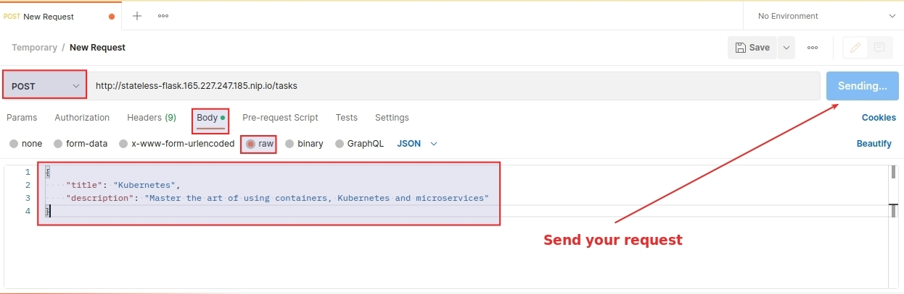
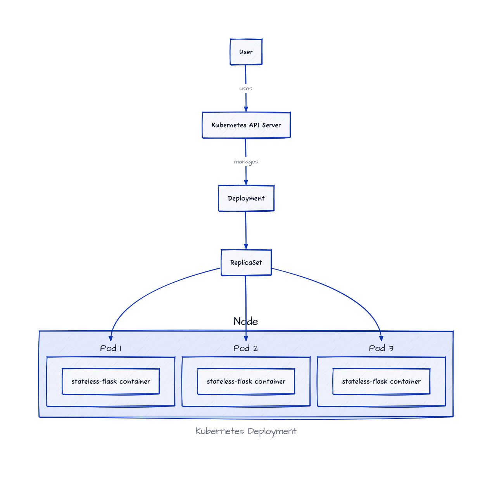
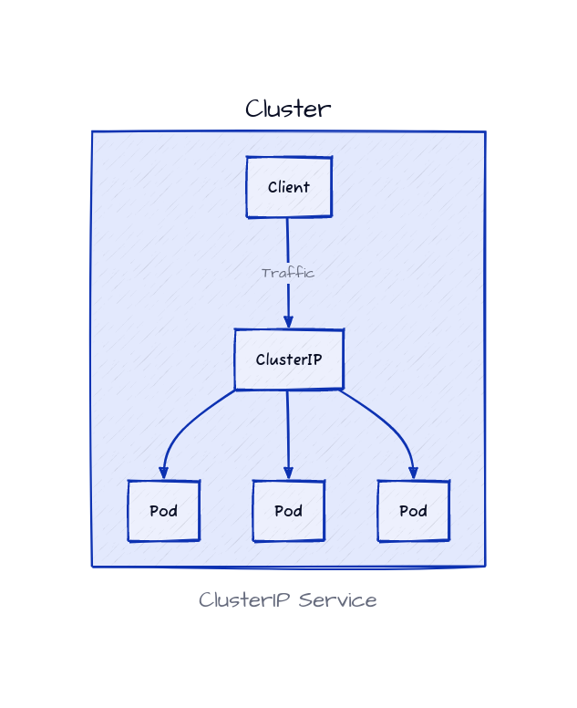
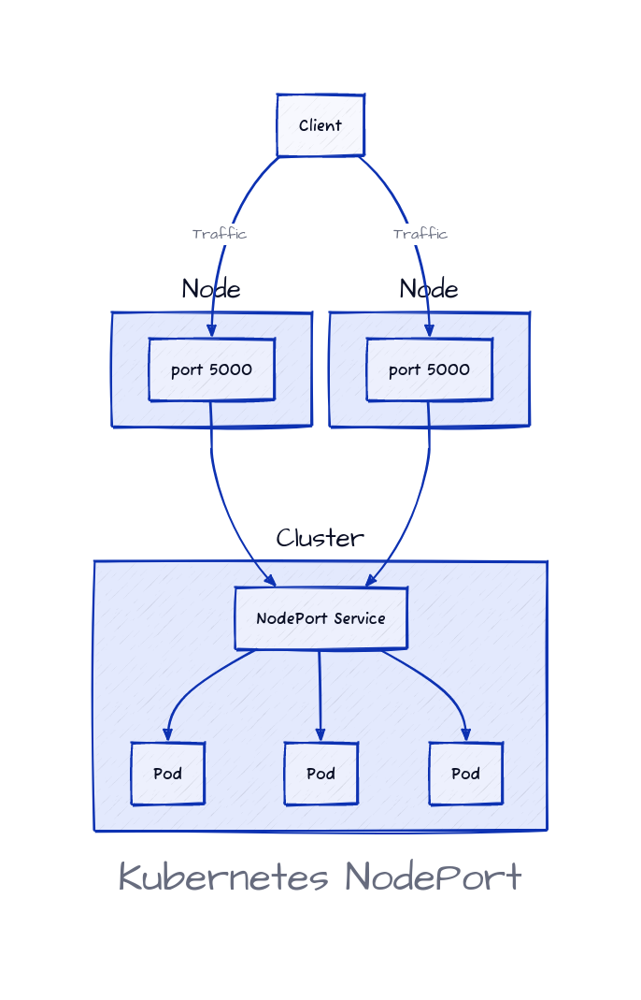
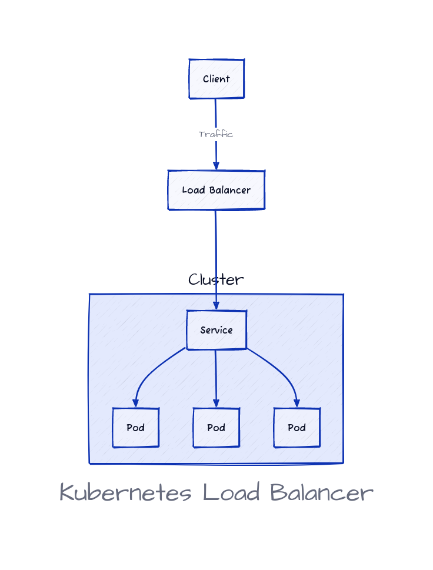
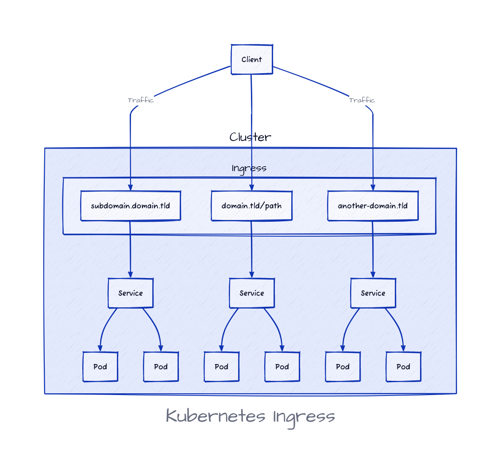

# Déploiement de microservices Stateless: Introduction

## Bug fix

```bash
rm /var/lib/dpkg/lock-frontend
rm /var/cache/apt/archives/lock
rm /var/cache/debconf/config.dat
rm /var/cache/debconf/passwords.dat 
rm /var/cache/debconf/templates.dat
```


## Prérequis

Nous allons utiliser notre serveur de développement Ubuntu sur lequel nous avons installé kubectl et téléchargé le fichier kubeconfig.

kubectl est un outil en ligne de commande utilisé dans la gestion et le déploiement des applications dans les clusters Kubernetes. Il est conçu pour faciliter l'interaction entre administrateurs et les clusters Kubernetes et présente une large gamme de fonctionnalités.

Afin de communiquer avec le serveur API Kubernetes et de gérer nos clusters et ressources Kubernetes, nous avons besoin d'installer cette CLI.

```bash
curl -LO "https://dl.k8s.io/release/$(curl -L -s https://dl.k8s.io/release/stable.txt)/bin/linux/amd64/kubectl"
sudo install -o root -g root -m 0755 kubectl /usr/local/bin/kubectl

```

Activez la fonctionnalité d'auto-complétion:

```bash
cat << EOF >> ~/.bashrc
if [ -f /etc/bash_completion ] && ! shopt -oq posix; then
    . /etc/bash_completion
fi
EOF

kubectl completion bash | sudo tee /etc/bash_completion.d/kubectl > /dev/null
sudo chmod a+r /etc/bash_completion.d/kubectl
echo 'source <(kubectl completion bash)' >>~/.bashrc
source ~/.bashrc
```

Copiez le fichier kubeconfig sur votre serveur de développement:

```bash
mkdir -p ~/.kube
```

Ajoutez le contenu du fichier yaml dans `~/.kube/config`.

Pour les exemples suivants, nous allons utiliser Python comme langage de programmation principal et Flask comme framework. Python et Flask sont faciles à comprendre même si vous n'êtes pas un développeur Python. Par conséquent, avec ces choix, ce guide sera facile à lire et à comprendre pour tous les développeurs.

Sur votre serveur de développement, commencez par installer:

- pip3: Le gestionnaire de paquets officiel et la commande pip pour Python 3.
- virtualenvwrapper: Un ensemble d'extensions pour créer et supprimer des environnements de développement virtuels Python.

```bash
apt update &&  apt install -y python3-pip

pip install virtualenvwrapper
export WORKON_HOME=~/Envs
mkdir -p $WORKON_HOME

cat << EOF >> ~/.bashrc
export VIRTUALENVWRAPPER_PYTHON='/usr/bin/python3'
source /usr/local/bin/virtualenvwrapper.sh
EOF

source ~/.bashrc
```

Créons un nouvel environnement virtuel:

```bash
mkvirtualenv stateless-flask
```

Créez ensuite les dossiers pour notre application Flask et installez ses dépendances.

```bash
mkdir -p stateless-flask
cd stateless-flask
mkdir -p app
mkdir -p kubernetes
pip install Flask==3.0.0
pip freeze > app/requirements.txt
```

Le code suivant crée une application de todo liste simple:

```python
cat << EOF > app/app.py
from flask import Flask, jsonify, request

app = Flask(__name__)

# Define a list of tasks
tasks = []

# route for getting all tasks
@app.route('/tasks', methods=['GET'])
def get_tasks():
    return jsonify({'tasks': tasks})

# Route for getting a single task
@app.route('/tasks', methods=['POST'])
def add_task():
    task = {
        'id': len(tasks) + 1,
        'title': request.json['title'],
        'description': request.json['description'],
    }
    tasks.append(task)
    return jsonify(task), 201

if __name__ == '__main__':
    app.run(debug=True, host='0.0.0.0', port=5000)
EOF
```

Ce code crée une application Flask qui définit une todo liste. Il y a deux routes - une pour récupérer toutes les tâches, et une autre pour ajouter une tâche.

La fonction `get_tasks()` renvoie une réponse JSON contenant toutes les tâches de la liste.

La fonction `add_task()` crée une nouvelle tâche avec un ID, un titre et une description, l'ajoute à la liste des tâches, et renvoie une réponse JSON contenant la nouvelle tâche.

Le bloc `if name == 'main':` exécute l'application Flask et la rend disponible sur l'ordinateur local sur le port 5000. Le mode debug est activé pour aider au développement.

Ensuite, nous allons créer un fichier Dockerfile :

```Dockerfile
cat << EOF > app/Dockerfile
# Use an official Python runtime as a parent image
FROM python:3.9-slim-buster
# Set the working directory to /app
WORKDIR /app
# Copy the current directory contents into the container at /app
COPY . /app
# Install any needed packages specified in requirements.txt
RUN pip install --no-cache-dir -r requirements.txt
# Make port 5000 available to the world outside this container
EXPOSE 5000
# Define environment variable
CMD ["python", "app.py"]
EOF
```

Nous pouvons maintenant construire l'image et l'exécuter pour la tester.

```bash
docker build  -t stateless-flask:v0 -f app/Dockerfile app
docker run -it -p 5000:5000 stateless-flask:v0
```

Puisque nous exposons le conteneur sur le port 5000 de l'hôte, nous interrogerons l'API générée par Flask en utilisant un outil comme Postman, l'adresse IP publique de notre hôte suivi du port 5000.

Téléchargez et installez [Postman](https://www.postman.com/downloads/).



Vous pouvez utiliser une requête POST avec les données suivantes :

```json
{
    "description": "Master the art of using containers, Kubernetes and microservices",    
    "title": "Kubernetes"
}
```

N'oubliez pas d'ajouter l'en-tête `Content-Type` en lui attribuant la valeur `application/json`.

Après avoir enregistré le premier élément, vous pouvez exécuter une requête GET sur `/tasks`, vous obtiendrez les mêmes données JSON que celles que vous avez stockées. Cependant, lorsque vous arrêtez le conteneur, les données sont effacées, ce qui est normal car l'application est stateless et ne stocke rien dans un datastore externe.

Maintenant, créez un compte sur [Docker Hub](https://hub.docker.com/) et poussez l'image.

```bash
docker login
docker tag stateless-flask:v0 <dockerhub_username>/stateless-flask:v0
docker push <dockerhub_username>/stateless-flask:v0
```

Remplacez `<dockerhub_username>` par votre nom d'utilisateur Docker Hub.

## Création d'un namespace

Nous pouvons déployer l'application dans le namespace par défaut, mais ce n'est pas recommandé, surtout lorsque vous avez plusieurs applications en cours d'exécution dans le même cluster. Dans ce cas, l'approche recommandée est de créer un namespace distinct pour chaque application.

Nous allons déployer l'API Flask dans un namespace différent de celui par défaut. Créons le :

```yaml
cat <<EOF > kubernetes/namespace.yaml
apiVersion: v1
kind: Namespace
metadata:
  name: stateless-flask
EOF
```

Appliquez maintenant le YAML.

```bash
kubectl apply -f kubernetes/namespace.yaml
```

Affichez la liste de tous les namespaces:

```bash
kubectl get ns
```

Vous devriez être en mesure de voir le nouveau Namespace créé.

> 💡 Un Namespace fournit une séparation virtuelle des ressources au sein d'un cluster.
>
> Il permet à plusieurs équipes ou applications d'utiliser le même cluster Kubernetes tout en disposant de leurs propres ensembles isolés de ressources telles que les pods, les services et les volumes.
>
> Cette séparation virtuelle aide à la gestion des ressources et évite les conflits entre les équipes ou les applications.
>
> Par exemple, lorsque vous voulez exécuter plusieurs applications sur un seul cluster, vous pouvez déployer chaque application dans un Namespace différent et une ressource Ingress qui achemine le trafic vers toutes ces applications dans un autre Namespace.

## Création du déploiement

Pour déployer notre conteneur Flask, nous devons créer un déploiement. Le déploiement créera un ReplicaSet et ce dernier sera responsable de maintenir un ensemble stable de Pods.

> 💡 Un Pod est l'unité la plus petite du modèle d'objet Kubernetes, et il représente une seule instance d'un processus en cours d'exécution dans le cluster.
>
> Un Pod peut contenir un ou plusieurs conteneurs, qui sont garantis de fonctionner ensemble sur le même hôte et de partager le même réseau et le même espace de stockage.
>
> Tous les conteneurs dans un Pod partagent le même ensemble de namespaces Linux, y compris le réseau, ce qui signifie qu'ils peuvent communiquer les uns avec les autres via l'interface réseau localhost.
>
> Les conteneurs dans un seul Pod partagent le même cycle de vie, lorsqu'un Pod est créé, tous les conteneurs sont créés et lorsque le Pod est tué ou supprimé, tous les conteneurs à l'intérieur de ce Pod disparaissent.
>
> Par exemple, si "container_a" et "container_b" s'exécutent sur le même Pod, tous deux ont la même adresse IP, qui est l'adresse IP du Pod. "container_a" accédera à "container_b" comme il accéderait à [localhost](http://localhost/) et vice-versa.  

Dans le manifeste YAML suivant, assurez-vous de remplacer `<votre-registre-docker>` par le nom d'utilisateur de votre Docker Hub.

```yaml
cat << EOF > kubernetes/deployment.yaml
apiVersion: apps/v1
kind: Deployment
metadata:
  name: stateless-flask
  namespace: stateless-flask
spec:
  replicas: 3
  selector:
    matchLabels:
      app: stateless-flask
  template:
    metadata:
      labels:
        app: stateless-flask
    spec:
      containers:
      - name: stateless-flask
        image: <votre-registre-docker>/stateless-flask:v0
        ports:
        - containerPort: 5000
EOF
```

Voyons ce que le fichier Deployment fait ligne par ligne :

- **`apiVersion`** spécifie la version de l'API Kubernetes à utiliser pour cet objet, qui est "apps/v1" dans ce cas.

- **`kind`** spécifie le type d'objet à créer, qui est un déploiement.

- **`metadata`** contient des métadonnées sur le déploiement, y compris le nom et le namespace.

- **`spec`** spécifie l'état souhaité du déploiement. Il contient le nombre de replicas à créer (dans ce cas, 3), ainsi qu'un sélecteur pour correspondre aux labels des pods qui doivent être gérés par le déploiement.

- Le champ **`selector`** dans un déploiement Kubernetes spécifie les labels utilisées pour identifier et sélectionner les pods que le déploiement gère. Dans notre code, le sélecteur spécifie que le déploiement gérera des pods avec le label **`app: stateless-flask`**. Cela signifie que tous les pods qui correspondent à ce label seront inclus dans l'ensemble de replicas maintenu par le déploiement, et tout pod qui ne correspond pas à ce label ne sera pas inclus. Le champ **`matchLabels`** dans le sélecteur spécifie les labels qui doivent correspondre pour qu'un pod soit inclus dans l'ensemble.

- **`template`** contient la spécification des pods qui doivent être créés par le déploiement. Il spécifie les labels à appliquer aux pods, qui doivent correspondre au sélecteur dans le **`spec`**.

- **`containers`** contient la liste des conteneurs à déployer dans les pods. Dans ce cas, il n'a qu'un seul conteneur nommé "stateless-flask", qui utilise l'image Docker spécifiée dans **`image`** et expose le port 5000.

Nous pouvons appliquer le fichier YAML et obtenir la liste des déploiements dans le namespace "stateless-flask". Assurez-vous de changer `<votre-nom-d-utilisateur-docker-registry>` par votre nom d'utilisateur Docker Hub.

```bash
kubectl apply -f kubernetes/deployment.yaml
kubectl get pods -n stateless-flask
```

Le schéma suivant montre les différentes ressources Kubernetes que nous avons créées.

Notez que notre cluster possède un noeud. Si nous en avions deux, les 3 Pods que nous avons créés seraient probablement répartis entre les noeuds.

> 💡 Un déploiement est responsable de la gestion d'un ensemble de replicas d'un Pod spécifique.
>
> Le déploiement garantit que le nombre désiré de replicas s'exécute à tout moment et fournit un moyen de réaliser des mises à jour progressives et des retours en arrière.
>
>Il fournit une interface déclarative pour déployer, mettre à jour et supprimer des Pods et des ReplicaSets.

> 💡 Un ReplicaSet est un autre objet Kubernetes qui est responsable de maintenir un ensemble stable de réplicas de Pods. Il fonctionne en veillant à ce qu'un nombre spécifique de réplicas de Pods basé sur un modèle défini (généralement défini dans un déploiement) soit en cours d'exécution.
>
> Les ReplicaSets sont souvent utilisés en tant que partie d'un déploiement, avec le déploiement gérant le ReplicaSet pour assurer le maintien du nombre de replicas souhaité. Il n'est donc pas recommandé de créer directement un ReplicaSet. Au lieu de cela, créez un déploiement.



## Examen des Pods et des Déploiements

Une commande utile que nous pouvons utiliser pour vérifier l'état, les événements et la configuration du pod est `kubectl describe`.

Si vous avez utilisé Docker, vous êtes certainement familier avec la commande `docker inspect <container>`. La commande `kubectl describe pod <pod>`, est quelque peu similaire.

```bash
kubectl -n stateless-flask describe pod <pod>
```

Remplacez `<pod>` par le nom de n'importe quel Pod. Vous pouvez obtenir la liste des Pods en utilisant la commande `kubectl -n stateless-flask get pods`.

Vous pouvez également décrire le déploiement en utilisant :

```bash
kubectl -n stateless-flask describe deployment <nom de déploiement>
```

L'une des informations les plus utiles fournies par la commande `describe` est la liste des événements.

Les événements fournissent un moyen de surveiller l'état des différents objets du système. Ces objets peuvent être des nœuds, des pods, des déploiements, des services, etc. Ils fournissent une trace d'audit des changements qui se produisent sur ces objets au fil du temps.

Les logs des pods sont un autre moyen de comprendre ce qui se passe à l'intérieur d'un pod. À l'aide de la commande suivante, nous pouvons voir les logs d'un pod:

```bash
kubectl -n stateless-flask logs <pod>
```

Vous devez remplacer `<pod>` par le nom d'un Pod.

Si vous voulez obtenir les logs de tous les pods en une seule commande, vous pouvez le faire en filtrant par le label. Voici un exemple :

```bash
kubectl -n stateless-flask logs -l app=stateless-flask
```

Nous utilisons `app=stateless-flask` car c'est ce que nous avons configuré dans le `template` de nos Pods dans le fichier Deployment (label `app: stateless-flask`)

Pour afficher les logs et suivre les modifications, vous pouvez ajouter le flag `-f`.

```bash
kubectl -n stateless-flask logs <pod> -f
kubectl -n stateless-flask logs -l app=stateless-flask -f
```

## Accéder aux Pods

Un Pod n'expose aucune adresse/port externe par défaut, par conséquent, si nous voulons voir l'application Flask s'exécuter, nous devons transférer le port interne du Pod vers l'un des ports de notre serveur de développement. Voici comment procéder:

```bash
kubectl port-forward stateless-flask-<pod_id> 5000:5000 -n stateless-flask
```

Assurez-vous de remplacer `stateless-flask-<pod_id>` par le nom de tout Pod. Vous pouvez obtenir la liste des Pods en utilisant `kubectl get pods -n stateless-flask`.

Vous pouvez également utiliser AWK pour obtenir le premier Pod qui apparaît sur la liste lorsque vous tapez `kubectl get pods` comme suit:

```bash
export pod=$(kubectl get pods -n stateless-flask | awk 'FNR==2{print $1}' )

kubectl port-forward $pod 5000:5000 -n stateless-flask
```

Dans les deux cas, le Pod est maintenant accessible via notre serveur local, nous pouvons vérifier sa réponse en utilisant:

```bash
curl http://0.0.0.0:5000/tasks
```

## Exposition d'un déploiement

Si nous voulons utiliser notre application Flask de manière régulière, nous devons la rendre accessible via un navigateur web. Cependant, il n'existe aucun accès externe à notre Pod, à moins que nous ne créions un port de transfert. C'est pourquoi nous avons besoin de créer un Service.

> 💡 Un Service est une abstraction puissante qui fournit un moyen transparent d'exposer un déploiement de Pods en tant que service réseau.
>
> Un déploiement est l'épine dorsale de votre application, gérant la création et la mise à l'échelle d'un ensemble de Pods identiques avec facilité. Pendant ce temps, un Service vous donne une adresse IP fiable et un nom DNS pour accéder à ces Pods.
>
> En définissant un Service pour un déploiement, vous pouvez facilement accéder aux pods à partir d'autres applications au sein du cluster ou de l'extérieur du cluster via l'adresse IP ou le nom DNS du Service.
>
> Ce découplage intelligent des Pods à partir du Service permet une gestion facile des Pods et offre plus de flexibilité dans la façon dont ils sont accessibles.

Il existe plusieurs façons d'exposer une application sur le réseau, notamment les services ClusterIP, NodePort, LoadBalancer, Ingress et les services Headless.

### Service ClusterIP

ClusterIP est le type de service par défaut qui fournit une adresse IP pour atteindre le service au sein du cluster. Il expose les Pods d'un cluster à d'autres objets dans le même cluster en utilisant une adresse IP interne, permettant une communication transparente entre les composants.

Le service ClusterIP est utilisé pour permettre la communication entre différents composants ou microservices au sein d'un cluster Kubernetes. Il agit comme une [adresse IP virtuelle](https://fr.wikipedia.org/wiki/Adresse_IP_viruelle) attribuée à un ensemble de Pods.

Voici à quoi ressemble un ClusterIP :



Voici comment créer un ClusterIP pour notre service :

```yaml
cat <<EOF > kubernetes/cluserip-service.yaml
apiVersion: v1
kind: Service
metadata:
  name: stateless-flask-clusterip-service
  namespace: stateless-flask
spec:
    type: ClusterIP
    selector:
        app: stateless-flask
    ports:
    - port: 5000
      protocol: TCP
      targetPort: 5000
EOF
```

- **`apiVersion`** : La version de l'API Kubernetes utilisée pour ce manifeste.
  
- **`kind`** : Le type d'objet Kubernetes décrit par ce manifeste. Dans ce cas, il s'agit d'un Service.
  
- **`metadata`** : Les métadonnées sur le Service, y compris son nom et son Namespace.
  
- **`spec`** : La spécification du Service, qui comprend son type, son sélecteur et ses ports.
  
- **`type: ClusterIP`** indique que ce Service est un service ClusterIP, ce qui signifie qu'il n'est accessible que dans le cluster.
  
- **`selector:`** définit un sélecteur qui identifie les Pods vers lesquels ce Service doit router le trafic. Dans ce cas, il sélectionne les Pods avec le label **`app: stateless-flask`**.
  
- **`ports:`** spécifie la configuration de port du Service. Dans ce cas, il expose le port 5000 des Pods en tant que port 5000 du Service.

- **`port`** fait référence au port sur lequel le service écoutera, tandis que **`targetPort`** fait référence au port sur lequel les Pods backend du Service écoutent.

Appliquer le fichier YAML et vérifier la liste des services:

```bash
kubectl apply -f kubernetes/cluserip-service.yaml
kubectl get svc -n stateless-flask
```

Pour accéder à l'application, nous avons besoin d'utiliser le service ClusterIP. Pour ce faire, nous utiliserons le port-forwarding de Kubernetes:

```bash
kubectl port-forward svc/stateless-flask-clusterip-service 5000:5000 -n stateless-flask
```

Maintenant, nous pouvons tester la connexion au service en utilisant une commande cURL.

```bash
curl http://127.0.0.1:5000/tasks
```

### Service NodePort

NodePort est un service qui expose un déploiement à l'extérieur sur un port statique sur chaque nœud du cluster. La plage de ports pour les services NodePort est de 30000 à 32767, ce qui permet au trafic externe d'atteindre le service sur le port spécifié, qui est ensuite transféré au pod.

L'un des avantages de NodePort est sa simplicité, car il ne nécessite pas de répartiteurs de charge externes ou de composants réseau. Il est également facile à utiliser et ne nécessite pas beaucoup de configuration.

Cependant, l'utilisation de NodePort présente quelques inconvénients. Il expose le service sur un port statique sur chaque nœud du cluster, ce qui peut causer des problèmes de sécurité si vous avez potentiellement des problèmes de sécurité. Il nécessite également l'ouverture d'une plage de ports sur tous les nœuds du cluster, ce qui peut être un vecteur d'attaque potentiel.

`NodePort` peut être utile à des fins de test et de débogage. Cependant, si vous avez une charge de travail de production et que vous souhaitez autoriser le trafic externe, ce n'est pas la solution la plus adaptée.



Voici comment créer un service `NodePort` :

```yaml
cat <<EOF > kubernetes/nodeport-service.yaml
apiVersion: v1
kind: Service
metadata:
  name: stateless-flask-nodeport-service
  namespace: stateless-flask
spec:
    type: NodePort
    selector:
        app: stateless-flask
    ports:
    - port: 5000
      protocol: TCP
      targetPort: 5000
      nodePort: 30000
EOF
```

Les ports sur lesquels ce service écoutera sont définis dans **`ports`**, y compris **`port`** (le port sur lequel le service écoute), **`protocol`** (le protocole utilisé par le port), **`targetPort`** (le port sur le pod vers lequel le trafic doit être envoyé) et **`nodePort`** (le port sur lequel le service est exposé sur chaque nœud du cluster). Dans ce cas, le service écoute sur le port **`5000`** et est exposé sur chaque nœud du cluster sur le port **`30000`**.

Maintenant, vous pouvez appliquer ce YAML :

```bash
kubectl apply -f kubernetes/nodeport-service.yaml
```

Listez les services :

```bash
kubectl get svc -n stateless-flask
```

Obtenez l'adresse IP externe de l'un des noeuds de votre cluster :

```bash
kubectl get nodes -o wide
```

À l'aide de votre navigateur Web, d'un outil tel que Postman ou cURL, vous pouvez vérifier la réponse de l'API à l'aide de l'adresse IP externe du noeud et du port 30000.

```bash
curl http://<external_ip>:30000/tasks
```

Si vous voulez tout faire en une seule commande, vous pouvez utiliser :

```bash
curl HTTP://$(kubectl get nodes -o wide | awk '{print $7}' | tail -n +2):30000/tasks
```

`kubectl get nodes -o wide | awk '{print $7}' | tail -n +2` permet d'obtenir l'adresse IP externe sans afficher toute la sortie de `kubectl get nodes -o wide`.

### Service LoadBalancer

LoadBalancer est un autre type de service disponible pour une utilisation dans un cluster Kubernetes.

Il aide à distribuer le trafic entrant à plusieurs réplica d'un pod.

Il est une implémentation du modèle [Load Balancing](https://en.wikipedia.org/wiki/Load_balancing_(computing)), qui est utilisé pour distribuer le trafic sur plusieurs nœuds, services, ou systèmes.

En Kubernetes, les choses sont un peu différentes : Pour mettre en œuvre ce modèle, vous aurez besoin de deux choses :

- Un service LoadBalancer
- Une machine d'équilibrage de charge

Alors que le service est un objet Kubernetes qui fait partie du cluster, la machine est externe et ne fait pas partie du cluster. Si vous gérez un cluster Kubernetes sur des serveurs bare-metal ou sur site, la mise en œuvre peut être difficile. Cependant, si vous utilisez un cluster géré en utilisant un cloud public tel que AWS, GCP ou DigitalOcean, les choses sont beaucoup plus simples.

Normalement, le fournisseur de cloud provisionne automatiquement la machine d'équilibrage de charge pour vous.

Un service d'équilibrage de charge peut aider à améliorer la disponibilité et la scalabilité d'une application en répartissant le trafic sur plusieurs replicas, ce qui réduit la probabilité d'un point de défaillance unique.

L'un de ses avantages importants est sa capacité à détecter automatiquement les replicas non fonctionnelles et à rediriger le trafic vers celles qui sont en bonne santé, ce qui ajoute une autre couche de fiabilité à votre charge de travail.

De plus, lorsque vous créez un équilibreur de charge, vous pouvez ajouter des fonctionnalités avancées comme la terminaison SSL et l'affinité de session.

Cependant, créer une machine d'équilibrage de charge pour chacun de vos services peut être coûteux. De plus, ajouter une couche de réseau supplémentaire peut introduire une latence, mais dans la plupart des cas, cela n'est pas significatif.



Pour créer un service LoadBalancer, utilisez le YAML suivant :

```yaml
cat <<EOF > kubernetes/loadbalancer-service.yaml
apiVersion: v1
kind: Service
metadata:
  name: stateless-flask-loadbalancer-service
  namespace: stateless-flask
spec:
    type: LoadBalancer
    selector:
        app: stateless-flask
    ports:
    - port: 5000
      protocol: TCP
      targetPort: 5000
EOF
```

Ici, un seul port est défini avec les propriétés suivantes :

- **`port`**: Le numéro de port sur lequel le service sera disponible.
- **`protocol`**: Le protocole utilisé par le service, dans ce cas TCP.
- **`targetPort`**: Le numéro de port sur lequel le service acheminera le trafic vers les Pods.

Exécutez la commande apply:

```bash
kubectl apply -f kubernetes/loadbalancer-service.yaml
```

Surveillez la liste de vos services en utilisant `kubectl get svc -n stateless-flask -w` et lorsque l'adresse IP externe de votre machine d'équilibrage de charge est prête, commencez à tester l'API en utilisant la même IP et le port 5000 (`port`).

Voyons les tests:

```bash
load_balancer_ip=$(kubectl get svc -n stateless-flask | grep "LoadBalancer" | awk '{print $4}')

curl http://$load_balancer_ip:5000/tasks
```

### Service Headless

Normalement, un service Kubernetes a une adresse IP virtuelle (ClusterIP) et un nom DNS qui résout cette adresse IP. Lorsqu'un client se connecte à l'adresse IP du service, il est automatiquement redirigé vers l'un des pods qui soutiennent le service. Que faire si je veux accéder à chaque Pod en utilisant sa propre adresse IP ?

Ceci est possible avec la fonctionnalité des services Headless de Kubernetes.

Les services Headless sont créés en utilisant la même syntaxe que les services réguliers, mais avec l'option **`clusterIP`** définie sur **`"None"`**.

Voici comment créer un service Headless :

```yaml
cat <<EOF > kubernetes/headless-service.yaml
apiVersion: v1
kind: Service
metadata:
  name: stateless-flask-headless-service
  namespace: stateless-flask
spec:
    clusterIP: None
    selector:
        app: stateless-flask
    ports:
    - port: 5000
      protocol: TCP
      targetPort: 5000
EOF
```

Vous pouvez maintenant créer le service :

```bash
kubectl apply -f kubernetes/headless-service.yaml
```

Ensuite, vous pouvez afficher la liste des services :

```bash
kubectl get svc -n stateless-flask
```

Pour accéder à un service Headless depuis l'extérieur du cluster, vous pouvez utiliser l'adresse IP publique d'un des Pods du service suivi du port spécifié dans le manifeste Kubernetes que nous avons déployé (5000 dans notre cas).

Afin de tester la résolution DNS, créons un Pod temporaire nommé `tmp01` qui exécute l'image "[tutum/dnsutils](https://hub.docker.com/r/tutum/dnsutils)". Nous déployons ce Pod car il a dnsutils installé, qui est un ensemble d'outils que nous pouvons utiliser pour tester la résolution DNS.

Nous utiliserons la commande `nslookup` pour tester la résolution DNS du service `stateless-flask-headless-service.stateless-flask.svc.cluster.local`.

Notez que le service Headless n'a pas d'adresse IP, mais il est accessible par son nom DNS interne :

```text
stateless-flask-headless-service.stateless-flask.svc.cluster.local
```

Déployez le Pod temporaire `tmp01` à l'aide de kubectl :

```bash
kubectl run tmp01 --image=tutum/dnsutils -- sleep infinity
```

Utilisez `nslookup` pour tester la résolution de DNS du service Headless. Nous pouvons exécuter une commande depuis un Pod sans être à l'intérieur de celui-ci à l'aide de :

```bash
kubectl exec -it tmp01 -- nslookup stateless-flask-headless-service.stateless-flask.svc.cluster.local
```

La sortie devrait être similaire à :

```bash
Server: <IP of the DNS server>
Address: <IP of the DNS server>#53

Name: stateless-flask-headless-service.stateless-flask.svc.cluster.local
Address: <IP of the Pod 1>
Name: stateless-flask-headless-service.stateless-flask.svc.cluster.local
Address: <IP of the Pod 2>
```

Remarquez comment le serveur DNS renvoie les adresses IP des Pods qui exécutent l'application `stateless-flask`. Un ClusterIP ne retournera jamais les adresses IP des Pods; il ne retournera que son propre adresse IP.

Le clustering de base de données est un cas d'utilisation courant pour les services Headless. RabbitMQ, MySQL et PostgreSQL sont des exemples d'applications qui peuvent être regroupées à l'aide de services Headless.

**Remarque**: Les noms internes ne sont accessibles que depuis l'intérieur du cluster. Ils utilisent le format `<nom-du-service>.<namespace>.svc.cluster.local`. Par exemple, pour accéder au service `stateless-flask-headless-service` depuis un autre namespace (différent de `stateless-flask`), nous utilisons `stateless-flask-headless-service.stateless-flask.svc.cluster.local` où `stateless-flask` est le namespace où le service s'exécute, `stateless-flask-headless-service` est le nom du service et `svc.cluster.local` est le nom de domaine du cluster.

### Service Ingress

Un Ingress est un composant qui permet aux connexions entrantes d'accéder au cluster. Il fournit un moyen de gérer l'accès externe aux services du cluster. Au lieu de créer un service LoadBalancer distinct pour chaque service, un Ingress vous permet de définir un ensemble de règles qui acheminent le trafic vers différents services en fonction de l'hôte ou du chemin de la demande.

Les services Ingress simplifient l'accès à vos services en utilisant une seule adresse IP et des noms de domaine. Il peut également utiliser un certificat SSL / TLS pour crypter le trafic. Il dispose d'une configuration flexible qui vous permet de définir les règles pour acheminer le trafic vers les services.

Par exemple, je peux rediriger le trafic vers le service `my-service` lorsque la demande est faite à l'hôte `myhost.com` et au chemin `/my-service`. Alors que lorsque la demande est faite à l'hôte `myhost.com` et au chemin `/my-other-service`, le trafic sera redirigé vers le service `my-other-service`.

Même si certains fournisseurs de cloud ne prennent pas en charge les services Ingress natifs, vous pouvez toujours utiliser un contrôleur Ingress open source ou commercial tel que [Traefik](https://traefik.io/) ou [Nginx](https://www.nginx.com/).

Voici une liste de certains d'entre eux:

- Nginx Ingress : C'est l'un des contrôleurs les plus populaires, il utilise le serveur web Nginx pour gérer le trafic Ingress.
- Traefik Ingress : Ce contrôleur prend en charge plusieurs technologies de proxy et offre une intégration facile avec les fournisseurs de services cloud.
- HAProxy Ingress : Ce contrôleur utilise le serveur proxy HAProxy pour gérer le trafic Ingress.
- Istio Ingress: Istio est une plateforme de service mesh qui offre un contrôleur Ingress avec des fonctionnalités de sécurité avancées telles que l'authentification, l'autorisation et le chiffrement.
- Contour Ingress : Ce contrôleur utilise le serveur proxy Envoy pour gérer le trafic Ingress et offre une intégration facile avec les ressources Kubernetes.

Il est également important de noter que les règles de routage sont basées sur la demande HTTP(S), il n'est donc pas possible de router le trafic TCP ou UDP. Si vous souhaitez exposer un port TCP/UDP, vous devrez utiliser un LoadBalancer ou un NodePort.



Avant de créer l'Ingress, nettoyons tous les services créés précédemment:

```bash
kubectl delete -f kubernetes/nodeport-service.yaml
kubectl delete -f kubernetes/loadbalancer-service.yaml
kubectl delete -f kubernetes/cluserip-service.yaml
```

Nous aurons besoin d'un service ClusterIP devant nos Pods. Ce service sera utilisé par le contrôleur Ingress pour router le trafic vers les Pods. Créons-le.

```yaml
cat <<EOF > kubernetes/stateless-flask-service.yaml
apiVersion: v1
kind: Service
metadata:
  name: stateless-flask
  namespace: stateless-flask
spec:
  selector:
    app: stateless-flask
  ports:
  - name: http
    protocol: TCP
    port: 5000
    targetPort: 5000
EOF

kubectl apply -f kubernetes/stateless-flask-service.yaml
```

Maintenant, créons la ressource Ingress.

Comme nous l'avons vu, il existe plusieurs contrôleurs Ingress disponibles. Nous utiliserons le contrôleur Ingress Nginx. Ce contrôleur est déployé en tant que Pod dans le cluster.

Pour installer le contrôleur d'Ingress Nginx, nous utiliserons un chart Helm.

[Helm] (https://helm.sh/) est un gestionnaire de packages pour Kubernetes. Il permet d'installer facilement des applications dans Kubernetes / clusterip-service.yaml.

Commencez par installer Helm sur votre serveur de développement:

```bash
curl https://raw.githubusercontent.com/helm/helm/master/scripts/get-helm-3 | bash
```

Ensuite, ajoutez le référentiel de contrôleur Nginx Ingress :

```bash
helm repo add ingress-nginx https://kubernetes.github.io/ingress-nginx
helm repo update
helm install nginx-ingress ingress-nginx/ingress-nginx 
```

Il est recommandé de créer un namespace dédié pour le contrôleur Ingress, mais nous allons utiliser le namespace par défaut pour simplifier les choses.

Si vous voulez utiliser Helm pour installer le contrôleur Ingress dans un namespace dédié, vous pouvez utiliser la commande suivante :

```bash
helm install nginx-ingress ingress-nginx/ingress-nginx --namespace ingress-nginx
```

La commande `helm install` installe le contrôleur Nginx Ingress à partir du référentiel des charts stables.

Il définit le paramètre `publishService` sur `true`, ce qui signifie que le contrôleur Ingress sera publié en tant que service.

Comme nous n'avons pas spécifié de namespace, Helm installera le contrôleur dans le namespace default.

Maintenant, nous pouvons lister les Pods et les Services dans le namespace par default:

```bash
kubectl get pods -n default
# or kubectl get pods
kubectl get services -n default
# or kubectl get services
```

Le contrôleur Nginx Ingress est déployé en tant que Pod dans le namespace default. Il est également publié en tant que service dans le namespace default.

Nous devons configurer le contrôleur Ingress pour utiliser le service ClusterIP que nous avons créé plus tôt. Pour ce faire, nous devons créer la ressource Ingress.

Notez que le contrôleur Ingress n'est pas la ressource Ingress. La ressource Ingress est une ressource Kubernetes qui définit les règles de routage et est utilisée par le contrôleur Ingress pour router le trafic vers les pods via le service ClusterIP.

Voici un exemple de ressource Ingress :

```yaml
apiVersion: networking.k8s.io/v1
kind: Ingress
metadata:
  name: my-ingress
spec:
  rules:
  - host: <host>
    http:
      paths:
      - path: <path>
        pathType: Prefix
        backend:
          service:
            name: <service-name>
            port:
              number: 5000
  ingressClassName: nginx
```

- La section `spec` définit les règles d'entrée. Dans ce cas, il y a une seule règle qui correspond à un nom d'hôte `<host>` spécifique et un préfixe de chemin `<path>`.
  
- La section `backend` spécifie vers quel service Kubernetes router le trafic pour les demandes correspondant à l'hôte et au chemin spécifiés. Dans ce cas, il spécifie un service nommé `<service-name>` sur le port 5000.

- Le champ `pathType` est défini sur `Prefix`, ce qui signifie que le chemin `/tasks` et tout chemin commençant par `/tasks/` correspondra à cette règle.

- Le champ `ingressClassName` spécifie le nom de la classe Ingress à utiliser pour cette entrée. Dans ce cas, il spécifie le contrôleur Ingress Nginx.

Nous pouvons également ajouter un champ « namespace » à la section « metadata » pour spécifier le namespace dans lequel le service est déployé.

Si nous utilisons la ressource « Ingress » ci-dessus, nous aurons un Ingress dans le namespace par défaut, alors que notre application est déployée dans le namespace « stateless-flask ». Cela pose un problème car le contrôleur d'Ingress ne pourra pas acheminer le trafic vers les Pods.

Pour résoudre ce problème, nous devons créer un service « ExternalName » dans le namespace « stateless-flask » qui pointe vers le service « ClusterIP » dans le namespace par défaut. Le service « ExternalName » est un type spécial de service qui permet de router le trafic vers un service dans un autre namespace.

Créez ce fichier:

```yaml
cat <<EOF > kubernetes/stateless-flask-service-externalname.yaml
apiVersion: v1
kind: Service
metadata:
  name: stateless-flask-service-externalname
  namespace: default
spec:
  type: ExternalName
  externalName: stateless-flask.stateless-flask.svc.cluster.local
EOF

```

Et appliquez-le:

```bash
kubectl apply -f kubernetes/stateless-flask-service-externalname.yaml
```

Vérifiez que le service ExternalName est créé:

```bash
kubectl get services -n default
```

Maintenant, nous pouvons créer la ressource Ingress:

```bash
export ingress_ip=$(kubectl get services nginx-ingress-ingress-nginx-controller | awk '{print $4}' | tail -n 1)
```

```yaml
cat <<EOF > kubernetes/ingress.yaml
apiVersion: networking.k8s.io/v1
kind: Ingress
metadata:
  name: my-ingress
spec:
  rules:
  - host: stateless-flask.${ingress_ip}.nip.io
    http:
      paths:
      - path: /tasks
        pathType: Prefix
        backend:
          service:
            name: stateless-flask-service-externalname
            port:
              number: 5000
  ingressClassName: nginx
EOF
```

Dans la ressource Ingress ci-dessus, nous avons spécifié le nom d'hôte `stateless-flask.<ingress-ip>.nip.io`. Assurez-vous de changer `<ingress-ip>` avec l'adresse IP du contrôleur Ingress. Vous pouvez obtenir l'adresse IP du contrôleur Ingress avec la commande suivante:

```bash
kubectl get services nginx-ingress-ingress-nginx-controller | awk '{print $4}' | tail -n 1
```

L'ingress fonctionne avec un DNS public, cependant, nous n'en avons pas. Nous utiliserons [nip.io](https://nip.io/) pour créer un nom de sous-domaine à la volée à partir d'une adresse IP. Vous êtes libre d'acheter et d'utiliser tout autre nom de domaine auprès d'un fournisseur ou d'utiliser un autre service gratuit comme [sslip.io](https://sslip.io/).

Appliquez la ressource Ingress :

```bash
kubectl apply -f kubernetes/ingress.yaml
```

Testez la ressource Ingress :

```bash
kubectl get ingress
```

Vous devriez voir la ressource Ingress dans la sortie. Le champ `ADDRESS` doit contenir l'adresse IP du contrôleur Ingress.

Maintenant, vous pouvez ouvrir votre navigateur et aller à

```text
http://stateless-flask.<ingress-ip>.nip.io/tasks
```

pour voir la liste des tâches.

Si vous avez d'autres cas d'utilisation, vous pouvez consulter la [documentation officielle](https://kubernetes.github.io/ingress-nginx/user-guide/basic-usage/) pour plus de détails.
