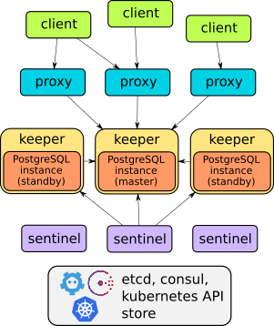

# Déploiement des microservices stateful: StatefulSets

## Qu'est-ce qu'un StatefulSet?

En termes simples, un StatefulSet est un objet d'API de charge de travail qui gère les applications stateful.

Lorsque vous exécutez des applications stateful dans Kubernetes, il est crucial de garantir la stabilité, la mise à l'échelle et l'intégrité des données. L'application stateful doit:

- Fonctionner de manière stable et fiable.
- Être mis à l'échelle vers le haut et le bas sans perte de données.
- Être mis à jour sans perte de données.
- Être rétrogradé vers une version précédente sans perte de données.
- Pouvoir être redémarré sans perte de données.

Les StatefulSets sont des objets API de Kubernetes conçus pour gérer les applications d'état comme les bases de données. Ils fournissent des fonctionnalités telles que la scalabilité et la mise à niveau tout en préservant l'ordre et l'unicité des pods.

Les StatefulSets sont utiles pour les applications qui nécessitent des fonctionnalités spécifiques telles que des identifiants de réseau uniques et stables, un stockage persistant qui reste inchangé lorsque les pods sont redémarrés et un moyen de déployer et de mettre à l'échelle dans un ordre spécifique.

## StatefulSet vs Deployment

Un StatefulSet attribue à chaque Pod un identifiant unique et persistant, contrairement à un Deployment. Cela permet au Pod de conserver son identité même en cas de réaffectation. Les StatefulSets conviennent particulièrement aux charges de travail nécessitant une persistance grâce à l'utilisation de volumes de stockage.

Les identifiants persistants attribués aux pods facilitent la correspondance des volumes avec les pods qui remplacent ceux qui ont échoué, garantissant que les données ne sont pas perdues en cas de défaillance.

Si une application ne nécessite pas d'identifiants réseau uniques et stables et de stockage persistant qui ne change pas lorsque les pods sont redémarrés, il est préférable d'utiliser un Deployment.

## Création d'un StatefulSet

Dans les exemples précédents, nous avons déployé une base de données PostgreSQL stateful en utilisant un Deployment. Dans cet exemple, nous allons déployer la même base de données en utilisant un StatefulSet à la place. Le StatefulSet est plus adapté à notre cas d'utilisation car nous exécutons une base de données PostgreSQL persistante.

Avant de continuer, supprimez le Deployment et le service que nous avons créés dans l'exemple précédent.

```bash
cd $HOME/stateful-flask

kubectl delete -f kubernetes/postgres-deployment.yaml
kubectl delete -f kubernetes/postgres-service.yaml
```

Nous pouvons également supprimer le volume et le PVC que nous avons créés dans l'exemple précédent:

```bash
kubectl delete -f kubernetes/postgres-pvc-pv.yaml
```

Maintenant, créez le fichier manifeste StatefulSet suivant:

```yaml
cat <<EOF > kubernetes/postgres-statefulset.yaml
apiVersion: apps/v1
kind: StatefulSet
metadata:
  name: postgres
  namespace: postgres
spec:
  replicas: 1
  selector:
    matchLabels:
      app: postgres
  serviceName: postgres
  template:
    metadata:
      labels:
        app: postgres
    spec:
      containers:
        - name: postgres
          image: postgres:10.1
          imagePullPolicy: Always
          ports:
            - containerPort: 5432
          envFrom:
            - configMapRef:
                name: postgres-config
          volumeMounts:
            - name: postgredb-volume
              mountPath: /var/lib/postgresql/data
              subPath: postgres
          env:
            - name: PGDATA
              value: /var/lib/postgresql/data/pgdata
  volumeClaimTemplates:
  - metadata:
      name: postgredb-volume
    spec:
      accessModes: [ "ReadWriteOnce" ]
      storageClassName: "do-block-storage"
      resources:
        requests:
          storage: 5Gi

EOF
```

Puis, créez le StatefulSet:

```bash
kubectl apply -f kubernetes/postgres-statefulset.yaml

```

Vérifiez le StatefulSet:

```bash
kubectl get statefulset -n postgres
```

Si vous supprimez et recréez le StatefulSet, les identificateurs des Pods seront les mêmes.

## Création d'un Service pour le StatefulSet

Les StatefulSets nécessitent un service Headless. Pour rappel, Kubernetes permet aux clients de découvrir les adresses IP des Pods via des recherches DNS, cela est possible grâce au service Headless. Sans service Headless, les adresses IP des Pods ne peuvent pas être directement découvertes, à la place, le serveur DNS renvoie une seule adresse IP, qui est l'adresse IP du service lui-même.

Voici comment créer un service Headless :

```yaml
cat <<EOF > kubernetes/postgres-headless-service.yaml
apiVersion: v1
kind: Service
metadata:
  name: postgres
  namespace: postgres
spec:
    clusterIP: None
    selector:
        app: postgres
    ports:
        - name: postgres
          port: 5432
EOF
```

Ensuite, créez le service Headless :

```bash
kubectl apply -f kubernetes/postgres-headless-service.yaml

```

## Tâches post-déploiement

Maintenant que nous avons un nouveau StatefulSet, nous devons recréer le schéma de la base de données et appliquer toutes les migrations SQL nécessaires.

```bash
kubectl exec -it <pod> -n stateful-flask -- flask db init
kubectl exec -it <pod> -n stateful-flask -- flask db migrate
kubectl exec -it <pod> -n stateful-flask -- flask db upgrade
```

Remplacez `<pod>` par le nom de l'un des Pods de l'application. Vous pouvez obtenir les noms des Pods avec la commande suivante :

```bash
kubectl get pods -n stateful-flask
```

Ou vous pouvez combiner les deux commandes:

```bash
export pod=$(kubectl get pods -n stateful-flask | awk '{print $1}' | tail -n 1)
kubectl exec -it $pod -n stateful-flask -- flask db init
kubectl exec -it $pod -n stateful-flask -- flask db migrate
kubectl exec -it $pod -n stateful-flask -- flask db upgrade
```

Enfin, vérifiez que l'application fonctionne:

```bash
export url="http://$(kubectl get ingress | awk '{print $3}' | tail -n 1)/tasks"

# add a new task
curl -X POST -H "Content-Type: application/json" -d '{"title":"New task", "description":"New description"}' $url

# get all tasks
curl $url
```

Vous pouvez également supprimer puis recréer le StatefulSet et vérifier que les données sont persistées.

```bash
kubectl delete -f kubernetes/postgres-statefulset.yaml
kubectl apply -f kubernetes/postgres-statefulset.yaml

curl $url
```

## StatefulSet vs Deployment: stockage persistant

Auparavant, nous avons créé un Deployment qui utilisait un PersistentVolumeClaim pour stocker les données. Voilà comment nous avons fait :

```yaml
apiVersion: v1
kind: PersistentVolumeClaim
metadata:
  name: postgres-pv-claim
  namespace: postgres
  labels:
    app: postgres
spec:
  accessModes:
  - ReadWriteOnce
  resources:
    requests:
      storage: 5Gi
  storageClassName: do-block-storage
```

Ensuite, nous avons monté le PersistentVolumeClaim dans le fichier manifeste du Deployment:

```yaml
apiVersion: apps/v1
kind: Deployment
[...]
spec:
  [...]
  template:
    [...]
    spec:
      containers:
        - name: postgres
          image: postgres:10.1
          [...]
      volumes:
        - name: postgredb
          persistentVolumeClaim:
            claimName: postgres-pv-claim
```

Le déploiement fonctionnera bien, mais ce n'est pas la meilleure façon de persister les données. Une fois le déploiement mis à l'échelle, les nouveaux pods peuvent ne pas avoir accès au même `PersistentVolumeClaim`. Cela signifie que les nouveaux pods n'auront pas accès aux mêmes données. Si vous regardez à nouveau la section `PersistentVolumeClaim`, vous remarquerez que nous avons utilisé:

```yaml
accessModes:
  - ReadWriteOnce
```

Cela signifie que le `PersistentVolumeClaim` ne peut être monté en lecture-écriture que par un seul noeud. Par conséquent, les nouveaux pods créés sur de nouveaux noeuds peuvent ne pas avoir accès au même `PersistentVolumeClaim`.

Que se passe-t-il si on change « accessModes » en « ReadWriteMany »?

```yaml
accessModes:
  - ReadWriteMany
```

Dans ce cas, le déploiement ne pourra toujours pas persister correctement les données. Étant donné que `ReadWriteMany` permet l'exécution sur plusieurs nœuds, notre application devrait être capable de gérer en simultané la lecture-écriture du même fichier, ce qui n'est pas le cas.

Afin d'éviter ces problèmes et parce que nous ne voulons pas gérer la concurrence des données au niveau de l'application, nous utiliserons les « VolumeClaimTemplates ». C'est ce que nous avons fait dans le fichier de modèle StatefulSet :

```yaml
volumeClaimTemplates:
  - metadata:
      name: postgredb-volume
    spec:
      accessModes: [ "ReadWriteOnce" ]
      storageClassName: "do-block-storage"
      resources:
        requests:
          storage: 5Gi
```

Les `VolumeClaimTemplates` demanderont dynamiquement un `PersistentVolumeClaim` auprès du `StorageClass`. Si vous avez « x » Pods, StatefulSet créera « x » `PersistentVolumeClaims`, chacun ayant un nom dans le format suivant :

```bash
<volumeClaimTemplate-name>-<nom-du-pod>-<ordinal-index>
```

Lorsque nous supprimons le StatefulSet, les volumes qui lui sont associés ne seront pas supprimés. Le Pod qui utilisait un `PersistentVolumeClaim` réutilisera le même volume lorsque le StatefulSet sera recréé.

Ceci est fait pour assurer la sécurité et l'intégrité des données.

## StatefulSet vs Deployment : service associé

Dans le premier exemple de Deployment PostgreSQL, nous créons un ClusterIP. Cela est nécessaire pour créer un service pour le Deployment qui est accessible uniquement depuis le cluster. Voici comment nous avons fait cela :

```yaml
apiVersion: v1
kind: Service
metadata:
  name: postgres # Sets service name
  namespace: postgres
  labels:
    app: postgres # Labels and Selectors
spec:
  type: NodePort # Sets service type
  ports:
    - port: 5432 # Sets port to run the postgres application
  selector:
    app: postgres
```

Cependant, dans le fichier de manifeste StatefulSet, nous devons non seulement accéder au Pod PostgreSQL à l'aide d'un service, mais nous voulons également être en mesure de mettre à l'échelle le nombre de Pods sans impacter l'intégrité des données, tels que la lecture-écriture simultanée du même fichier.

Pour résoudre ce problème, nous avons utilisé StatefulSet et `VolumeClaimTemplates` pour permettre à tous les Pods de partager le répertoire de données `/var/lib/postgresql/data`. Cependant, l'accès aux Pods via un Service est resté problématique. L'implémentation standard de Kubernetes d'un Service ne fonctionne pas avec PostgreSQL car elle utilise un équilibreur de charge ou un proxy pour diriger le trafic vers les Pods. Au lieu de cela, chaque Pod doit être directement découvert par le client. C'est pourquoi nous avons utilisé un Headless Service.

L'utilisation d'un Headless Service garantit que l'application stateful fonctionne correctement en fournissant une identité réseau stable pour le cluster de base de données. Même si quelque chose d'inattendu se produit, comme la défaillance d'un Pod et la mise en service d'un nouveau avec une nouvelle adresse IP, le Headless Service garantit que le nouveau Pod a une identité réseau stable.

## StatefulSets et mise à l'échelle

PostgreSQL n'est pas seulement un outil, mais un écosystème d'outils. Pensez à PostgreSQL comme le noyau d'un système d'exploitation; il fournit une fonctionnalité de base, mais vous avez besoin d'outils supplémentaires pour le rendre utile. Il existe différents outils et techniques disponibles pour résoudre le problème de la cohérence des données, comme la construction de notre propre cluster PostgreSQL en utilisant la réplication en continu, l'utilisation d'un outil tel que [Patroni](https://github.com/zalando/patroni), ou l'une de ses alternatives.

Bien que cela puisse sembler facile à première vue, la cohérence des données est en réalité un problème complexe. Il est donc préférable d'utiliser un outil stable qui est déjà disponible et maintenu par une communauté, plutôt que de réinventer la roue.

En ce qui concerne Kubernetes, il existe plusieurs outils que nous pouvons utiliser :

- [Zalando PostgreSQL Operator](https://github.com/zalando/postgres-operator)
- [PostgreSQL HA package par Bitnami](https://github.com/bitnami/charts/tree/main/bitnami/postgresql-ha)
- [PGO](https://github.com/CrunchyData/postgres-operator)
- [Stolon](https://github.com/sorintlab/stolon)
- Et [plus](https://www.google.com/search?q=postgres+higly+available+on+kubernetes)

Dans les sections suivantes, nous allons expérimenter avec Stolon.

## Stolon : introduction

Stolon est un gestionnaire PostgreSQL natif pour la haute disponibilité conçu pour les applications cloud. Il vous permet de maintenir une instance PostgreSQL hautement disponible sur vos conteneurs (avec intégration Kubernetes) ainsi que sur d'autres types d'infrastructure, tels que les infrastructures cloud IaaS et les anciennes infrastructures.

L'architecture de Stolon comprend trois composants principaux :

- **Keeper**: Il gère une instance PostgreSQL, convergeant vers la "clusterview" calculée par le sentinelle leader.
- **Sentinel**: Il découvre et surveille les gardiens et les proxys, et calcule la "clusterview" optimale.
- **Proxy**: Le point d'accès client. Il force la connexion vers le bon master PostgreSQL et ferme de manière forcée les connexions aux anciens masters. 



Stolon possède de nombreuses fonctionnalités utiles, comme décrit dans la [documentation](https://github.com/sorintlab/stolon):

- Exploite la réplication en continu PostgreSQL.
- Résilient à tous types de partitionnement, il privilégie la cohérence à la disponibilité tout en cherchant à maintenir une disponibilité maximale.
- Fournit une intégration Kubernetes pour atteindre la haute disponibilité de PostgreSQL.
- Utilise un magasin de clusters tel que etcd, Consul ou le API Server Kubernetes en tant que magasin de données hautement disponible et pour l'élection du leader.
- Prend en charge la réplication asynchrone (par défaut) et synchrone.
- Permet une configuration de cluster complète en quelques minutes et une administration facile du cluster.
- Peut effectuer une récupération à un point dans le temps en s'intégrant à votre outil de sauvegarde/restauration préféré.
- Prend en charge le cluster de secours pour la réplication multi-sites et la migration sans temps d'arrêt quasi nul.
- Offre la découverte automatique de services et la reconfiguration dynamique, gérant les processus PostgreSQL et Stolon qui changent leur adresse.
- Utilise pg_rewind pour une resynchronisation rapide de l'instance avec le master actuel. 
