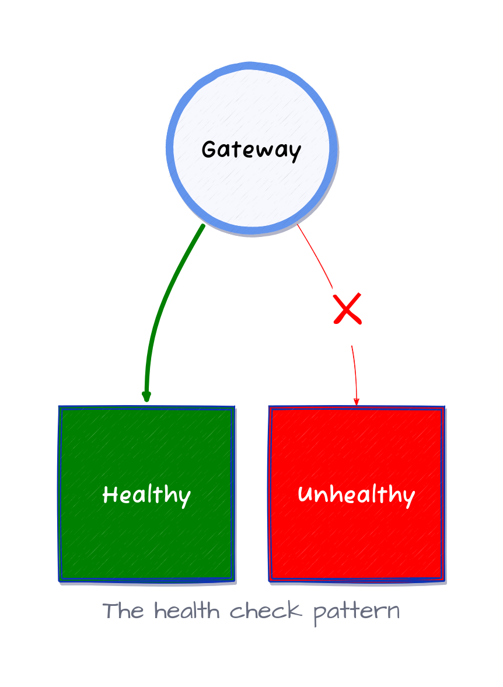
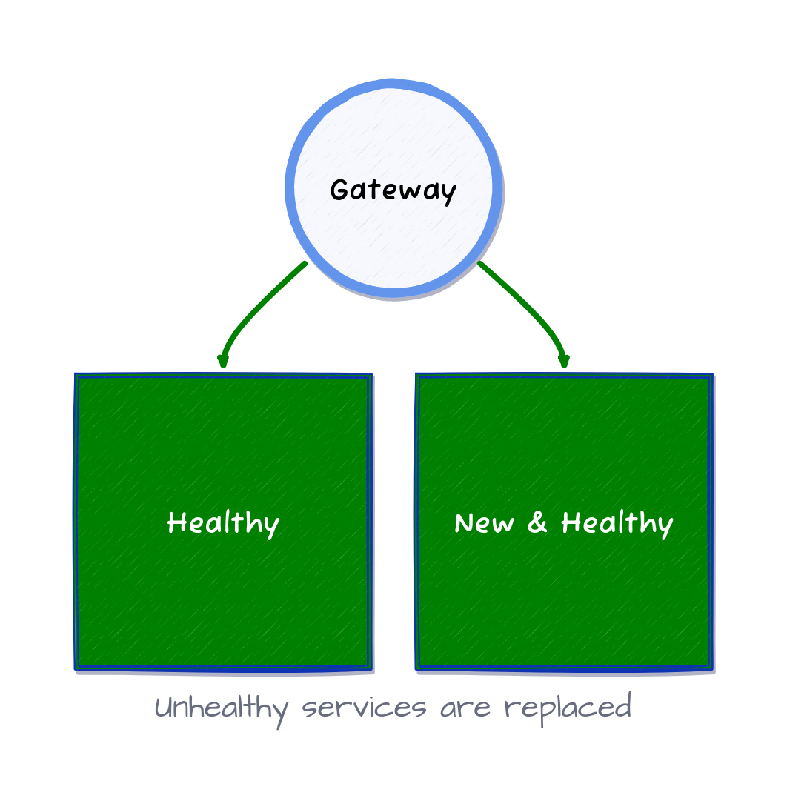

# Bonnes pratiques pour les microservices : healthcheck

## Healthcheck

L'une des best practices dans le développement de microservices et d'applications sur Kubernetes est de mettre en place des healthcheck (vérifications de santé).

Les healthcheck sont une façon de surveiller la santé d'un microservice. Ils sont utilisés par l'infrastructure pour déterminer si un microservice est en bonne santé ou non. Si un microservice n'est pas en bonne santé, il est coupé du réseau et ne reçoit plus de trafic. Cela permet d'éviter que les demandes ne soient envoyées à un microservice qui ne peut pas y répondre.



Les systèmes résilients utilisent les healthcheck pour détecter, supprimer les microservices non sains et les remplacer par de nouveaux.



Ceci est important lorsqu'un microservice est en cours de démarrage. L'infrastructure ne transmettra pas de demandes à un microservice tant qu'il ne sera pas prêt à les recevoir. C'est pourquoi il existe différents types de healthcheck et de concepts à prendre en considération lors de leur mise en œuvre, tels que donner à un microservice le temps de démarrer avant de le considérer comme en mauvaise santé ou de fermer un microservice après un certain nombre de healthcheck ratées, etc.

Heureusement, Kubernetes fournit un moyen de mettre en œuvre des healthcheck. Les healthcheck Kubernetes sont mises en œuvre à l'aide de sondes et c'est ce que nous allons couvrir dans cette partie.

## Probes de liveness et de readiness

Les healthcheck Kubernetes sont mises en œuvre à l'aide de sondes (probes). Il existe deux types de sondes: liveness (vitalité) et readiness (disponibilité).

La sonde liveness est utilisée pour déterminer si un conteneur dans un Pod fonctionne correctement. Kubernetes exécute périodiquement la sonde liveness et si elle réussit, le conteneur est considéré comme vivant. S'il échoue, le conteneur est considéré comme mort et Kubernetes le redémarre.

La ReadinessProbe est utilisée pour déterminer si un conteneur dans un Pod est prêt à recevoir des demandes. Tout comme la sonde de Liveness, Kubernetes exécute périodiquement la ReadinessProbe et si elle réussit, le conteneur est considéré comme prêt. S'il échoue, le conteneur n'est pas encore prêt.

## Types de sondes

Il existe trois types de sondes : HTTP, TCP et Exec.

- **Les sondes HTTP** sont utilisées pour déterminer si un conteneur est en vie ou prêt en envoyant une requête HTTP à un point de terminaison spécifique. Si le point de terminaison renvoie n'importe quel code supérieur ou égal à 200 et inférieur à 400, la sonde réussit. Si le point de terminaison renvoie tout autre code, la sonde échoue.

- Les **sondes TCP** sont utilisées pour déterminer si un conteneur est en vie ou prêt en essayant d'établir une connexion TCP vers un port spécifique. Si la connexion est établie, la sonde réussit. Si la connexion échoue, la sonde échoue.

- Les **sondes Exec** sont utilisées pour déterminer si un conteneur est en vie ou prêt en exécutant une commande à l'intérieur du conteneur. Si la commande retourne un code de sortie zéro (0), la sonde réussit. Si la commande retourne un code de sortie non nul, la sonde échoue.

Le tableau suivant résume les 3 types de sondes :

| Type de sonde  | Description                                             |
|----------------|---------------------------------------------------------|
| Sonde HTTP     | Envoie une requête HTTP à un point final spécifié.      |
| Sonde TCP      | Ouvre une connexion TCP vers un port spécifié.           |
| Sonde Exécuter | Exécute une commande spécifiée à l'intérieur du conteneur. |

## Mise en œuvre des sondes

Les sondes sont mises en œuvre dans la spécification Pod.

Voici un exemple de spécification Pod avec des sondes de readiness et de préparation HTTP:

```yaml
kubectl apply -f - <<EOF
---
# create a temporary namespace to perform our test
apiVersion: v1
kind: Namespace
metadata:
  name: healthcheck
---
# create a Deployment with liveness and readiness probes
apiVersion: apps/v1
kind: Deployment
metadata:
  name: stateless-flask
  namespace: healthcheck
spec:
  replicas: 1
  selector:
    matchLabels:
      app: stateless-flask
  template:
    metadata:
      labels:
        app: stateless-flask
    spec:
      containers:
      - name: stateless-flask
        image: eon01/stateless-flask:v0
        ports:
        - containerPort: 5000
        livenessProbe:
          httpGet:
            path: /tasks
            port: 5000
          initialDelaySeconds: 5
          periodSeconds: 5
          timeoutSeconds: 3
          successThreshold: 1
          failureThreshold: 3
        readinessProbe:
          httpGet:
            path: /tasks
            port: 5000
          initialDelaySeconds: 10
          periodSeconds: 15
          timeoutSeconds: 10
          successThreshold: 1
          failureThreshold: 15
        # terminationGracePeriodSeconds: 10
EOF
```

Les sondes de liveness et de readiness sont configurées à l'aide des champs `livenessProbe` et `readinessProbe`, et les deux utilisent des sondes HTTP.

- Le champ `initialDelaySeconds` est utilisé pour spécifier le nombre de secondes à attendre avant d'exécuter la première sonde. La valeur par défaut est de 0 secondes.
- Le champ `periodSeconds` est utilisé pour spécifier le nombre de secondes à attendre entre chaque test. La valeur par défaut est de 10 secondes.
- Le champ `timeoutSeconds` est utilisé pour spécifier le nombre de secondes à attendre avant de considérer qu'une sonde a échoué. La valeur par défaut est de 1 seconde.
- Le champ `successThreshold` est utilisé pour spécifier le nombre de sondes réussies consécutives avant de considérer que le conteneur est actif et prêt. La valeur par défaut est de 1.
- Le champ `failureThreshold` est utilisé pour spécifier le nombre de sondes consécutives ayant échoué avant de considérer que le conteneur est mort ou inactif. La valeur par défaut est de 3.
- Le champ `terminationGracePeriodSeconds` est utilisé pour spécifier le nombre de secondes à attendre avant de terminer un conteneur après avoir reçu le signal SIGTERM. La valeur par défaut est de 30 secondes. Cela peut être défini au niveau du Pod ou au niveau de la sonde du conteneur. S'il est défini au niveau de la sonde, cela remplace la valeur définie au niveau du Pod.

Voici un tableau qui récapitule les différents champs:

| Champ | Description |
|-------|-------------|
| `initialDelaySeconds` | Temps en secondes à attendre avant d'exécuter la première sonde. |
| `periodSeconds` | Nombre de secondes à attendre entre chaque sonde. |
| `timeoutSeconds` | Nombre de secondes à attendre avant de considérer une sonde comme ayant échoué. |
| `successThreshold` | Nombre de sondes consécutives réussies avant de considérer que le conteneur est actif ou prêt. |
| `failureThreshold` | Nombre de sondes consécutives ayant échoué avant de considérer que le conteneur est mort ou pas prêt. |
| `terminationGracePeriodSeconds` | Nombre de secondes à attendre avant de terminer un conteneur après la réception d'un signal SIGTERM. |

Les autres types de sondes sont configurés de la même manière. Voici un exemple de spécification Pod avec deux probes TCP pour la vérification de readiness et de liveness :

```yaml
[..]
    livenessProbe:
      tcpSocket:
        port: 5000      
    readinessProbe:
      tcpSocket:
        port: 5000
[..]
```

Ceci est utile pour les microservices qui n'exposent pas de point de terminaison HTTP, mais écoutent sur un port spécifique.

Voici un exemple de spécification Pod avec des sondes d'exécution pour la vérification de readiness et de préparation :

```yaml
[..]
    livenessProbe:
      exec:
        command:
        - cat
        - /tmp/healthy
    readinessProbe:
      exec:
        command:
        - cat
        - /tmp/healthy
[..]
```

Ceci est utile pour les microservices qui nécessitent des vérifications plus complexes. Par exemple, un microservice ne doit pas être considéré comme prêt tant que la base de données qu'il utilise n'est pas prête. Dans ce cas, un script peut être utilisé pour vérifier si la base de données est prête et renvoyer un code de sortie zéro si elle l'est, et un code de sortie différent de zéro si ce n'est pas le cas.

```bash
#!/bin/bash

# wait for the database to be ready
while ! mysqladmin ping -h mysql -u root -p$MYSQL_ROOT_PASSWORD --silent; do
    sleep 1
done

# return a zero exit code if the database is ready
exit 0
```

Ensuite, le script peut être utilisé dans la ReadinessProbe:

```yaml
[..]
    readinessProbe:
      exec:
        command:
        - /bin/bash
        - /tmp/wait-for-db.sh
[..]
```
